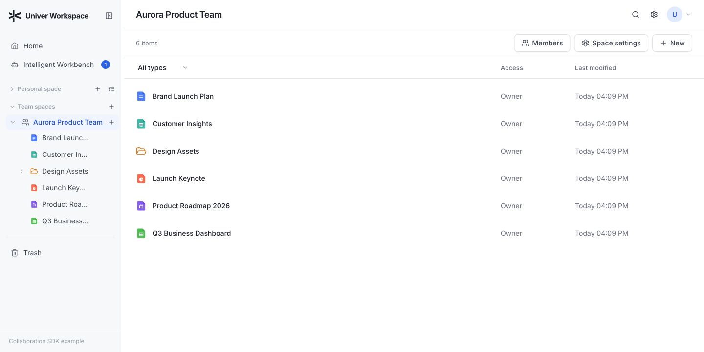
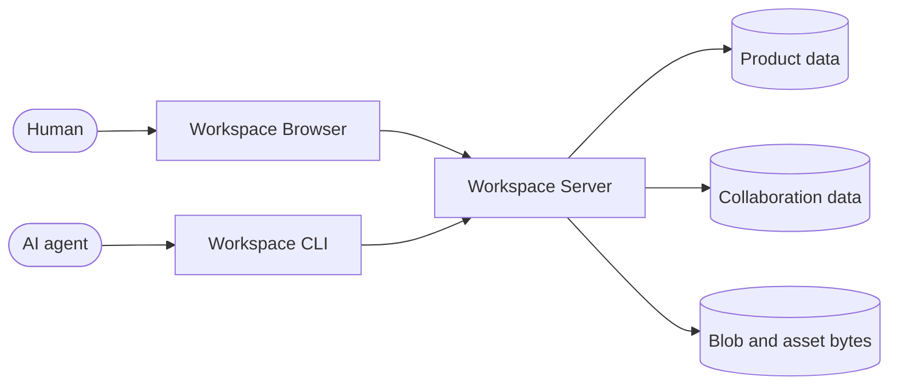

<div align="center">

# Univer Workspace

**An open-source Office workspace where people and AI agents create, collaborate, and review together.**

[Univer Docs](https://docs.univer.ai/) · [Office SDK](https://office.univer.ai/) · [CLI guide](apps/cli/README.md) · [Issues](https://github.com/dream-num/univer-workspace/issues)

[](LICENSE)
[](package.json)
[](package.json)

English | [简体中文](README.zh-CN.md)

</div>

Univer Workspace is a deployable knowledge and collaboration product built on the
[Univer SDK](https://docs.univer.ai/). It combines a human-facing Browser, a shared
Server, and an agent-ready CLI so people and AI agents can work on the same Sheets,
Docs, Slides, Bases, and Boards.

Agents work in isolated Worktrees, verify their changes, and hand the result to a
person for review. People stay in control of what is merged into the shared trunk.



## Why Univer Workspace

| For people                                              | For agents                                                         | For operators                                                        |
| ------------------------------------------------------- | ------------------------------------------------------------------ | -------------------------------------------------------------------- |
| Organize content in Personal and Team Spaces            | Create and edit rich Office content through the Univer Facade API  | Deploy one Browser and Server application                            |
| Co-edit Sheets, Docs, Slides, Bases, and Boards         | Inspect data, render screenshots/PDFs, and run layout checks        | Keep product, collaboration, and Blob data under application control |
| Share content with role- and node-aware access control  | Discover version-matched Skills and APIs offline                   | Integrate password, GitHub, Discord, or application OAuth login      |
| Use Recent, Trash, file import/export, and review views | Work through multiple rounds without changing trunk                | Operate a documented HTTP API with explicit recovery boundaries      |

## How it works



The Browser is the interactive editing and review surface. The CLI gives agents a
structured way to load, understand, edit, validate, and render the same content. The
Server resolves authoritative identity and permissions, owns Workspace product
workflows, and composes the Univer Collaboration SDK.

Worktree turns agent editing into an explicit review workflow:

```text
create Worktree
→ agent edits and verifies an isolated draft
→ Ready
→ human reviews in the Browser
→ Merge or Reopen
→ trunk
```

Intermediate changes remain isolated from shared content until a person accepts
them. For every Worktree Unit, the Browser can request one self-contained current
Trunk-to-Worktree comparison package and render both read-only states alongside a
semantic change list. See the [CLI guide](apps/cli/README.md) for the complete
product workflow.

## Quick start

### Requirements

- Node.js 24 or newer
- pnpm 11

Install dependencies and prepare the application configuration:

```bash
pnpm install
cp apps/workspace/.env.example apps/workspace/.env
```

Start the Server:

```bash
pnpm workspace:dev:server
```

In another terminal, start the Browser development server:

```bash
pnpm workspace:dev:web
```

Open <http://127.0.0.1:5173>. Vite provides hot module replacement and proxies API
and WebSocket traffic to the Server at <http://127.0.0.1:3020>.

The Server can also serve the latest built Browser from port 3020 when
`apps/workspace/dist/public` exists. Its product API is available at
<http://127.0.0.1:3020/api-docs> and
<http://127.0.0.1:3020/openapi.yaml>.

Configuration, authentication, storage, Docker, and database migration details live
in the [Workspace application guide](apps/workspace/README.md).

## Use the Workspace CLI

Install the agent-facing CLI:

```bash
npm install --global univer-workspace-cli@latest
```

Point the CLI at your own Workspace deployment, then begin browser-approved login:

```bash
univer-workspace-cli config set workspace.origin <origin>
univer-workspace-cli login
```

After the user approves the displayed URL and verification code, complete the
one-time exchange:

```bash
univer-workspace-cli login --complete
```

The installed package includes version-matched Skills, structured JSON output,
Facade API discovery, content inspection, PNG/PDF rendering, Office exchange, and Worktree
workflows. See the [CLI guide](apps/cli/README.md) for the complete usage and login
contract.

## Repository layout

```text
apps/workspace                 Workspace Browser, Server, HTTP contract, and deployment app
apps/cli                       Agent-ready remote Workspace automation application
packages/client-core           Private Node-hosted Workspace Agent Client capabilities
packages/reference-provider   Private Browser-only referenced-Unit policy
scripts                       SDK version and local CLI release tooling
```

This repository is the product composition root, not a replacement for the upstream
SDKs. Univer Runtime owns the Unit model, rendering, Facade APIs, and Office content
capabilities. Univer Collaboration SDK owns snapshots, revisions, OT, realtime
collaboration, and Worktree protocol contracts. Univer CLI SDK owns the reusable
headless runtime, execution, inspection, and rendering capabilities.

Workspace owns product identity, Spaces, hierarchy, ACLs, sharing, Trash, Recent,
Blob storage policy, remote workflows, and deployment. Client Core shares storage-neutral authentication,
Workspace workflows, local Node-hosted Blob/Asset transfer, and the worker-backed content runtime between
repository applications, including Node-hosted Office exchange, Typst compile/materialize/apply, render Unit
assembly, screenshots, PNG/PDF output, Slide layout lint, the render-page source, and the SVG
compile/measure/apply workflow; the reference-provider package remains Browser-only.
Both are private implementation modules, not additional public applications or SDKs.

## Architecture principles

- **One authoritative Server.** Client-provided users, roles, Resources, Units,
  Worktrees, and revisions are never trusted as authority.
- **Separate storage boundaries.** Product data, collaboration state, and Blob bytes
  have distinct owners and are coordinated through durable, idempotent operations.
- **Published SDK contracts only.** The repository consumes public package exports and
  never depends on adjacent source checkouts.
- **One exact SDK baseline.** Version-coupled `@univer-cli/*`, `@univerjs/*`, and
  `@univerjs-pro/*` packages always move together.
- **Contract-first HTTP.** OpenAPI source, generated types, Server routes, Browser, and
  CLI must describe the same behavior.

Read the [technical architecture](apps/workspace/docs/architecture.md),
[application design](apps/workspace/docs/application-design.md), and
[data model](apps/workspace/docs/data-model.md) before changing these boundaries.

## Development and verification

Run the smallest relevant check while iterating, then use the repository-level suite
before claiming a complete change:

```bash
pnpm typecheck
pnpm test
pnpm build
pnpm --filter @univerjs/univer-workspace test:production-import
pnpm package:workspace-cli
```

HTTP contract changes also require:

```bash
pnpm --filter @univerjs/univer-workspace api:verify
```

Update every version-coupled Univer dependency and the lockfile with the repository
script rather than editing individual manifests:

```bash
pnpm update:sdk --sdk_version <exact-sdk-version>
```

## Delivery model

The CLI and Workspace deployment are delivered independently from the same source:

- A stable `vX.Y.Z` tag on `main` releases `univer-workspace-cli@X.Y.Z` with the
  `latest` dist-tag.
- Workspace deployment is a separate manual workflow. It builds either an existing
  stable tag or an exact commit as `sha-<commit>`. Pushing a release tag does not
  deploy the Server.

Stable CLI releases validate the repository-wide SDK baseline and test
the actual package artifact before publication.

## Documentation

| Resource                                                            | Scope                                                                  |
| ------------------------------------------------------------------- | ---------------------------------------------------------------------- |
| [Univer Runtime documentation](https://docs.univer.ai/)             | Browser Runtime, presets, plugins, Facade API, and editor capabilities |
| [Univer Office SDK documentation](https://office.univer.ai/)        | Office SDK stack: Runtime, Collaboration, CLI, and Worktree            |
| [Workspace application guide](apps/workspace/README.md)             | Configuration, authentication, storage, Docker, and upgrades           |
| [Workspace CLI guide](apps/cli/README.md)                           | Installation, login, agent workflows, and package contract             |
| [Client Core package](packages/client-core/README.md)               | Private Node-hosted client capability boundary                          |
| [Technical architecture](apps/workspace/docs/architecture.md)       | Browser, Server, storage, OpenAPI, and module boundaries               |
| [HTTP contract](apps/workspace/contracts/http/README.md)            | Product API source and generation workflow                             |
| [Reference-provider package](packages/reference-provider/README.md) | Private Browser referenced-Unit policy                                 |

## Contributing

Issues and pull requests are welcome. Before changing code, read [AGENTS.md](AGENTS.md)
and the README or design document closest to the target. Preserve unrelated changes,
do not edit generated files by hand, and include the verification required by the
affected boundary.

## Runtime development license

The Browser and CLI contain synchronized copies of the approved runtime development
credential for local use. It rotates every 90 days and is not the repository software
license. Set `VITE_UNIVER_LICENSE` for Browser builds or `UNIVER_LICENSE` for the CLI
to override it.

## License

Univer Workspace is licensed under [Apache-2.0](LICENSE).
