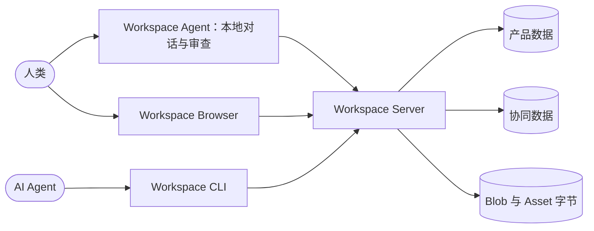

<div align="center">

# Univer Workspace

**一个让人类与 AI Agent 共同创作、协作和审阅的开源 Office 工作空间。**

[Univer 文档](https://docs.univer.ai/) · [Office SDK 文档](https://office.univer.ai/) · [CLI 指南](apps/cli/README.md) · [Workspace Agent](apps/agent/README.zh-CN.md) · [Issues](https://github.com/dream-num/univer-workspace/issues)

[](LICENSE)
[](package.json)
[](package.json)

[English](README.md) | 简体中文

</div>

Univer Workspace 是一个基于 [Univer SDK](https://docs.univer.ai/) 构建、可独立部署的知识管理与
团队协作产品。你可以使用 Workspace Browser 直接编辑，通过 Workspace Agent 对话并审查变更，
也可以使用 CLI 自动化处理任务。三个入口连接同一个负责文档存储和权限的 Workspace Server，
让人类与 AI Agent 共同处理 Sheet、Doc、Slide、Base 与 Board。

Agent 在隔离的 Worktree 中工作、验证修改，再把结果交给人类审阅；只有经过确认的内容才会合入
共享 trunk。


## 为什么选择 Univer Workspace

| 面向人类                                     | 面向 Agent                                          | 面向运维                                    |
| -------------------------------------------- | --------------------------------------------------- | ------------------------------------------- |
| 使用个人与团队 Space 组织内容                | 通过 Univer Facade API 创建、修改丰富的 Office 内容 | 部署一套 Browser 与 Server 应用             |
| 共同编辑 Sheet、Doc、Slide、Base 与 Board    | 检查数据、渲染截图/PDF 并执行布局检查               | 自主管理产品数据、协同数据与 Blob 数据      |
| 通过角色与 Node 级权限控制分享和访问         | 离线发现版本匹配的 Skill 与 API                     | 接入密码、GitHub、Discord 或应用 OAuth 登录 |
| 使用最近访问、回收站、文件导入导出与审阅视图 | 多轮修改而不影响 trunk                              | 运行具备明确恢复边界、文档完备的 HTTP API   |

## 选择操作入口

| 入口 | 适用场景 | 开始使用 |
| --- | --- | --- |
| **Workspace Browser** | 直接编辑文档、协同、组织 Space 和审阅变更 | [启动 Workspace](#快速开始) |
| **Workspace Agent** | 在文档旁与 Agent 对话、引用本地或远程文件与文件夹、审查 Worktree 变更 | [安装和使用 Agent](apps/agent/README.zh-CN.md#安装与首次使用) |
| **Workspace CLI** | 从终端、脚本或已有 Agent 环境自动化处理文档 | [CLI 安装与使用](apps/cli/README.md) |

Workspace Agent 是基于 DSH（DeepSeek Harness）的本地 Web 应用。
它的本地文件引用指向运行 Agent 的机器，Workspace 文档仍由连接的服务管理。
Agent 和 CLI 都可以连接现有的 Workspace 部署，或在本地启动的 Workspace。

## 工作原理



Browser 提供直接编辑和协同界面；Workspace Agent 将对话、文档预览和 Worktree 审查放在一起；
CLI 为 Agent 提供加载、理解、修改、验证和渲染同一份内容的结构化入口。
Server 解析权威身份与权限、拥有 Workspace 产品 workflow，并组合 Univer Collaboration SDK。

Worktree 将 Agent 编辑转化为边界清晰的审阅流程：

```text
创建 Worktree
→ Agent 编辑并验证隔离草稿
→ Ready
→ 人类在 Browser 或 Workspace Agent 中审阅
→ Merge 或 Reopen
→ trunk
```

在人类接受之前，中间修改不会进入共享内容。完整产品 workflow 见
[CLI 指南](apps/cli/README.md)。

## 快速开始

以下命令启动 Workspace 服务与 Browser。如需对话界面，继续按照
[Workspace Agent 指南](apps/agent/README.zh-CN.md#安装与首次使用)安装。

### 环境要求

- Node.js 24 或更高版本
- pnpm 11

安装依赖并准备应用配置：

```bash
pnpm install
cp apps/workspace/.env.example apps/workspace/.env
```

启动 Server：

```bash
pnpm workspace:dev:server
```

在另一个终端启动 Browser 开发服务器：

```bash
pnpm workspace:dev:web
```

打开 <http://127.0.0.1:5173>。Vite 提供热更新，并将 API 与 WebSocket 流量代理到
<http://127.0.0.1:3020> 的 Server。

当 `apps/workspace/dist/public` 存在时，Server 也可以在 3020 端口提供最近一次构建的 Browser。
产品 API 文档位于 <http://127.0.0.1:3020/api-docs> 和
<http://127.0.0.1:3020/openapi.yaml>。

配置、认证、存储、Docker 与数据库迁移的详细说明见
[Workspace 应用指南](apps/workspace/README.md)。

## 使用 Workspace Agent

安装 Agent 后，可以通过对话处理文档、使用 `@` 引用，并在对话旁审查变更。
[Agent 指南](apps/agent/README.zh-CN.md#安装与首次使用)提供可以直接交给编程 Agent 的安装提示词，
尚未克隆仓库也能使用，同时包含手动安装与使用说明。
指南会引导你选择或启动自己的 Workspace 服务、注册 OAuth 回调、配置模型凭据，
并打开本地启动器打印的完整 token URL。

## 使用 Workspace CLI

安装面向 Agent 的 CLI：

```bash
npm install --global univer-workspace-cli@latest
```

先把 CLI 指向你自己的 Workspace 部署，再开始需要 Browser 确认的登录流程：

```bash
univer-workspace-cli config set workspace.origin <origin>
univer-workspace-cli login
```

用户确认命令输出的 URL 与验证码后，完成一次性交换：

```bash
univer-workspace-cli login --complete
```

安装包包含版本匹配的 Skill、结构化 JSON 输出、Facade API 发现、内容检查、PNG/PDF 渲染、Office
文件交换与 Worktree workflow。完整用法和登录合同见 [CLI 指南](apps/cli/README.md)。

## 仓库结构

```text
apps/workspace                 Workspace Browser、Server、HTTP contract 与部署应用
apps/cli                       面向 Agent 的远程 Workspace 自动化应用
apps/agent                     用于文档对话与 Worktree 审查的 Workspace Agent 应用
packages/client-core           私有的 Node-hosted Workspace Agent Client 能力
packages/reference-provider   仅供 Browser 使用的私有 referenced-Unit policy
packages/dsh-univer-workspace-plugin        Workspace Agent 的 Workspace 能力与浏览器 UI
packages/dsh-univer-workspace-skin-plugin   Workspace Agent 的 Workspace 视觉皮肤
scripts                       SDK 版本与 CLI 本地发布工具
```

本仓库是产品的 composition root，不重新实现上游 SDK。Univer Runtime 拥有 Unit 模型、渲染、
Facade API 与 Office 内容能力；Univer Collaboration SDK 拥有 snapshot、revision、OT、实时协同与
Worktree 协议合同；Univer CLI SDK 拥有可复用的 headless runtime、执行、检查与渲染能力。

Workspace 拥有产品身份、Space、目录层级、ACL、分享、回收站、最近访问、Blob 存储策略、远程
workflow 与部署。Client Core 在仓库应用之间共享存储无关的认证、Workspace workflow、本机
Node-hosted Blob/Asset 传输与 worker-backed 内容 runtime，包括 Node-hosted Office exchange、Typst
编译/materialize/apply、render Unit 装配、截图、PNG/PDF 输出、Slide layout lint、render-page 源码与
SVG 编译/测量/apply workflow；reference-provider package 仍只供 Browser 使用。两者都是私有实现
模块，不是额外的公开应用或 SDK。

## 架构原则

- **一个权威 Server。** 不把客户端提供的 User、Role、Resource、Unit、Worktree 或 revision
  当作权威信息。
- **分离存储边界。** 产品数据、协同状态与 Blob 字节各有明确所有者，并通过持久化、幂等的
  Operation 协调。
- **只使用已发布的 SDK 合同。** 仓库只消费 package 的公开 export，不依赖相邻源码 checkout。
- **一个精确 SDK baseline。** 所有版本耦合的 `@univer-cli/*`、`@univerjs/*` 与
  `@univerjs-pro/*` package 始终一起升级。
- **HTTP contract first。** OpenAPI 源文件、生成类型、Server route、Browser 与 CLI 必须描述
  同一行为。

修改这些边界前，请阅读[技术架构](apps/workspace/docs/architecture.md)、
[应用层设计](apps/workspace/docs/application-design.md)与[数据模型](apps/workspace/docs/data-model.md)。

## 开发与验证

开发过程中先运行最小相关检查；在宣称完整变更前，运行合适的仓库级验证：

```bash
pnpm typecheck
pnpm test
pnpm build
pnpm --filter @univerjs/univer-workspace test:production-import
pnpm package:workspace-cli
```

修改 HTTP contract 时还需要运行：

```bash
pnpm --filter @univerjs/univer-workspace api:verify
```

升级 Univer SDK 时使用仓库脚本一次性更新所有版本耦合依赖与 lockfile，不要单独编辑 manifest：

```bash
pnpm update:univer-sdk --sdk_version <exact-sdk-version>
```

## 交付模型

CLI 与 Workspace 部署基于同一份源码，但各自独立交付：

- 在 `main` 包含的稳定 `vX.Y.Z` tag 上手动触发 CLI 发布 workflow，选择 `latest`，
  并显式开启 `publish`，才会发布 `univer-workspace-cli@X.Y.Z`。创建、推送 tag 不触发 CI 或发布。
- Workspace 使用独立的手动部署 workflow，构建已有稳定 tag，或把精确 commit 标记为
  `sha-<commit>`。推送 release tag 不会部署 Server。

稳定版 CLI 发布会检查整个仓库的 SDK baseline，并在发布前验证实际 package artifact。

## 文档

| 资源                                                                | 范围                                                       |
| ------------------------------------------------------------------- | ---------------------------------------------------------- |
| [Univer Runtime 文档](https://docs.univer.ai/)                      | Browser Runtime、Preset、Plugin、Facade API 与编辑器能力   |
| [Univer Office SDK 文档](https://office.univer.ai/)                 | Office SDK 技术栈：Runtime、Collaboration、CLI 与 Worktree |
| [Workspace 应用指南](apps/workspace/README.md)                      | 配置、认证、存储、Docker 与升级                            |
| [Workspace CLI 指南](apps/cli/README.md)                            | 安装、登录、Agent workflow 与 package 合同                 |
| [Workspace Agent 指南](apps/agent/README.zh-CN.md)                         | 本地 Profile、浏览器 OAuth、会话、文件、Worktree 与身份切换    |
| [Client Core package](packages/client-core/README.md)               | 私有 Node-hosted client 能力边界                           |
| [技术架构](apps/workspace/docs/architecture.md)                     | Browser、Server、存储、OpenAPI 与模块边界                  |
| [HTTP contract](apps/workspace/contracts/http/README.md)            | 产品 API 源文件与生成流程                                  |
| [Reference-provider package](packages/reference-provider/README.md) | Browser 私有 referenced-Unit policy                        |

## 参与贡献

欢迎提交 Issue 与 Pull Request。修改代码前，请阅读 [AGENTS.md](AGENTS.md) 和目标附近的 README
或设计文档；保留无关改动，不手工编辑生成文件，并完成受影响边界要求的验证。

## Runtime 开发 License

Browser 与 CLI 包含内容同步、经过批准的 runtime 开发凭据，用于本地开发。该凭据每 90 天轮换
一次，并不是本仓库的软件许可证。Browser 构建可以通过 `VITE_UNIVER_LICENSE` 覆盖，CLI 可以
通过 `UNIVER_LICENSE` 覆盖。

## License

Univer Workspace 使用 [Apache-2.0](LICENSE) 许可证。
