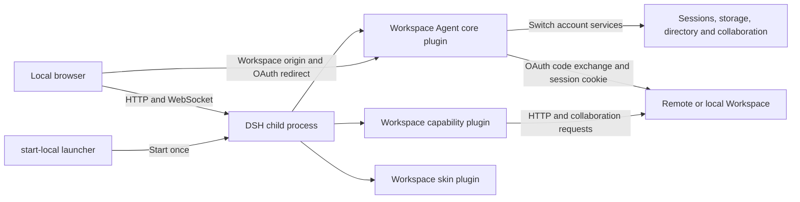
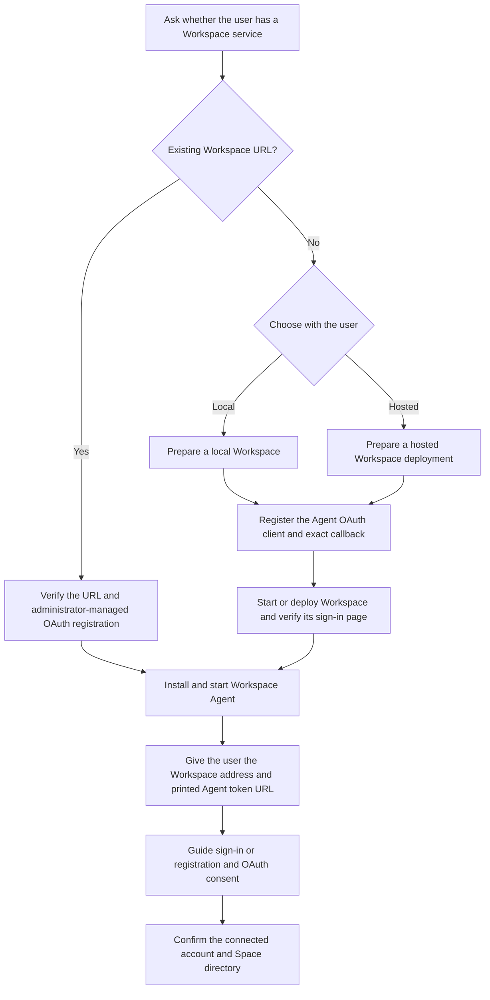

# Univer Workspace Agent

English | [简体中文](README.zh-CN.md)

Univer Workspace Agent is a local web application for discussing documents with
an AI agent and reviewing its changes in Worktrees. It connects to one local or
remote Univer Workspace service. The application uses DSH (DeepSeek Harness),
assembled from published `@deepseek-ai/*` packages as three bundles:

- `@univerjs/workspace-agent` (this package) — the service core:
  Workspace browser OAuth authorization, one process-wide remote
  connection exposed through the `workspaceAuth` cordis service, the
  Workspace origin settings namespace, and account-scoped service lifecycles
  that switch data directories without restarting DSH.
- `dsh-univer-workspace-plugin` — the Univer capability plugin: space ↔
  dsh-workspace reconciliation and the agent toolset operating remote
  Workspace Units.
- `dsh-univer-workspace-skin-plugin` — the browser skin aligning the DSH UI
  with the Workspace brand.

## Installation and first use

Workspace Agent runs on your machine and connects to a Univer Workspace service.
You need both applications: Workspace stores documents and enforces access;
Agent provides the conversation and review interface. DSH is the agent runtime
assembled by the installation commands below; no prior DSH installation is needed.

### Set up with an agent

Give your coding agent this prompt, even if you have not cloned the repository:

> Help me install and run Univer Workspace Agent from https://github.com/dream-num/univer-workspace. First ask whether I have a Workspace service and its URL. If not, explain local versus hosted setup and help me choose, then follow the repository README to start or deploy one. Follow apps/agent/README.md to check prerequisites, configure the connection, and verify startup. Explain any credentials or user actions needed, and give me the Workspace address and complete printed Agent token URL, guiding me through login and authorization.

The agent should follow the [setup workflow](#agent-assisted-setup), explain the
choices, and confirm that your account and Space directory load. Workspace login
and model credentials are separate: browsing documents does not require sending a
model request, but chatting with the agent does.

### Set up manually

1. Check the [requirements and installation commands](#local-web-client-quick-start)
   and clone the repository. This application is built from source; its private
   packages are not installed from npm as a standalone Workspace Agent release.
2. Choose a Workspace service. For an existing service, ask its administrator to
   register the [Agent OAuth client and callback](#connect-to-a-local-workspace).
   Otherwise, [start Workspace locally](#connect-to-a-local-workspace) or follow
   the [Workspace deployment guide](../workspace/README.md#docker).
3. Build and start Agent with the [local installation commands](#local-web-client-quick-start).
   Open the complete token URL printed by the launcher, then connect and authorize
   your Workspace account in **Settings → Workspace**.
4. Follow [Using Workspace Agent](#using-workspace-agent) to browse documents,
   start a conversation, and review changes. Keep the launcher running while using
   the application.

The shared `workspace.univer.plus` service is an internal test deployment. Use your
own Workspace service for this setup.

## Responsibilities

- Obtain one remote Workspace session through browser OAuth with PKCE. The local
  Workspace Agent has no users or permissions of its own; every local browser uses the
  same current connection and Workspace remains authoritative for remote ACLs.
- Provide `workspaceAuth` to sibling plugins: effective Workspace origin,
  authenticated HTTP client, and current remote identity.
- Keep the DSH process and local browser authentication running while a
  connection change reloads account-owned sessions, storage and Workspace services.
- Keep Workspace capability routes, Viewer UI, template actions, and Space
  behavior in the consuming plugins; this package only composes them.
- Own the composition patch that mounts the three bundles and the deployment
  webserver/connection rows.

## Runtime architecture

The Workspace Agent keeps the local DSH process separate from the remote Workspace
service. Workspace remains the authority for identity, permissions, Spaces,
Nodes, Resources, and collaboration data.



The core plugin owns connection and identity lifecycle. The capability plugin
owns Workspace tools and file/document interactions. The skin plugin only owns
branding and visual tokens. The Workspace Agent uses Cordis dependency lifecycles to drain
account-owned services before activating the new identity. Session logs, search
indexes, attachments and Workspace records use the existing origin-and-user
runtime directory; switching back restores that directory. The HTTP listener,
browser authentication, model credentials and settings remain running.

Each rendered page carries a connection version. HTTP requests and collaboration
WebSocket upgrades from an old page are rejected after a switch. Other open tabs
reload when the new runtime is ready, so their old selections cannot operate on
the new account. Business notifications use a logical Remote stream on DSH's
existing WebSocket mux. The Workspace Agent shares one authenticated Workspace Worktree
feed across local tabs; a reconnect invalidates the open review views and directory
so missed changes are fetched again. Idle tabs do not poll connection status.
OAuth completion and logout use short readiness checks for at most 45 seconds.
A lost DSH connection or rejected stale-account request also checks readiness
before reopening the application. Switching stops the previous account's active agent runtime;
already accepted remote operations remain owned by the Workspace server.

## Local data and storage

The quick start keeps installation and runtime data outside the repository.

| Location | Contents | Isolation |
| --- | --- | --- |
| `UWH_DSH_BOOTSTRAP` | Isolated installation of the published DSH CLI | Shared by the local installation |
| `DSH_HOME` | Profile metadata and packaged plugin bundles | Shared by the local installation |
| `UWH_DSH_DATA_HOME` | `connection.json`, identity-specific DSH runtimes, and local session/attachment data | Runtime data is separated by Workspace origin and user id |
| `UWH_SHARED_SETTINGS_PATH` | Local model and interface settings; defaults to `$UWH_DSH_DATA_HOME/shared/settings.yaml` | Shared across identities |
| `UWH_SHARED_CREDENTIALS_PATH` | DSH model credentials and browser-session signing state; defaults to `$UWH_DSH_DATA_HOME/shared/.credentials.yaml` | Shared across identities; never contains Workspace session cookies |

The active connection file contains the Workspace origin, a non-secret user
identity, and the server-side session credential required by the local DSH
runtime. Treat the file as sensitive local state. Do not commit it, upload it,
or include its values in bug reports. Workspace product data, collaboration
snapshots, and Blob bytes remain in the connected Workspace deployment; the
Workspace Agent does not copy those databases into its local data directory.

## Non-responsibilities

- Implementations of DSH session persistence and attachment storage providers.
- Workspace product APIs, the Unit data model, or collaboration contracts —
  those stay in the Workspace application and the Univer SDKs.
- Any publication contract: this is a private workspace package, installed
  into a dsh profile from the repository build, never from the npm registry.

## Model credentials

On first launch, dismiss the DSH testing notice with **Continue**. The model
setup dialog offers **Configure later** if you only want to browse Workspace
and review changes; sending agent messages still requires model credentials.

DSH model settings and credentials are local-machine state; they are not tied
to a Workspace user. For a local profile, run without `NODE_ENV=production` or
set `UWH_MODEL_SETTINGS_ENABLED=true`, then configure the stock DSH Models page.
You can instead export `DEEPSEEK_API_KEY` or another provider credential before
starting the supervisor; an inherited environment value wins and is read-only.
The file-backed credential provider uses the supervisor's shared credentials
path, so identity-specific DSH runtimes reuse the same model configuration.
Workspace Session Cookies stay in the separate connection state and are never
written to model settings.

## Build

`pnpm build` emits `lib/index.js` (node host bundle), `lib/identity.js`, and
`lib/client.js` (browser bundle). The capability plugin emits its own
`lib/client.css`; profile assembly lives in this package's `scripts/` and
`cordis.patch.yml`.

### Render and screenshot tools

`univer_lint` and `univer_screenshot` use the pinned Univer render runtime.
They require both the version-matched static render page and a compatible
Chrome/Chromium executable. The local quick start builds the page and exports
`UWH_RENDER_PAGE_ROOT`; set `UWH_RENDER_BROWSER` when the browser executable is
not discoverable on `PATH`. The production Docker image supplies both assets.
If `UWH_RENDER_PAGE_ROOT` is missing, the tools return an explicit prerequisite
error and do not claim that visual verification passed.

Native addons used by the capability plugin remain external runtime
dependencies. The Workspace Agent image installs the platform-specific packages once
while assembling the profile; the runtime container only copies that assembled
profile and does not download or compile binaries during startup.

## Agent-assisted setup




Before installing, ask whether the user already has a Workspace service and its
browser URL. If they do, verify that it is reachable and supports the Agent OAuth
client; explain any registration changes its administrator needs to make.

If they do not, explain the choices: a local Workspace runs on their own machine,
while a hosted deployment needs a server and an address they can reach. Ask which
they prefer, then follow [Connect to a local Workspace](#connect-to-a-local-workspace)
or the [Workspace deployment guide](../workspace/README.md#docker). Use the
repository's default branch when cloning; no feature-branch checkout is required.

Check the documented Node.js/pnpm, package registry, model credentials, and license
requirements before starting. Tell the user which credentials or configuration
are missing and what they need to provide; never assume access to the internal
test service. If running through SSH or inside a container, make sure the user
can reach the supplied URLs and that the OAuth callback matches that setup.

Verify both the Workspace sign-in page and the Agent startup before handing off.
Give the user their Workspace address and the complete printed Agent token URL,
explain which page to open, and guide them through registration or login and
consent. Startup alone is not a complete setup: confirm that the connected account
and its Space directory appear. Keep installation commands in the linked guides
as the single source of truth.

## Local Web client quick start

Use Node.js 24 or newer and the pnpm version declared in the root
`package.json` (currently 11.24.0). Clone the repository and install its
dependencies from the repository root.
If you already have a checkout, use its root directory instead of cloning again:

```bash
git clone https://github.com/dream-num/univer-workspace.git
cd univer-workspace
pnpm install --frozen-lockfile
```

The checked-in `.npmrc` selects the registry for the pinned Univer SDK release.
The installation also needs access to the public npm registry for DSH packages.

The Workspace Agent is a local Web page, not a desktop application. The DSH CLI must be
installed outside this pnpm workspace so its React 18 dependency tree does not
enter the Univer React 19 graph. From the repository root, prepare one isolated
local installation:

```bash
export UWH_LOCAL_ROOT="${XDG_CACHE_HOME:-$HOME/.cache}/univer-workspace-harness"
export UWH_DSH_BOOTSTRAP="$UWH_LOCAL_ROOT/dsh-cli"
export DSH_HOME="$UWH_LOCAL_ROOT/install"
export UWH_DSH_DATA_HOME="$UWH_LOCAL_ROOT/data"
mkdir -p "$UWH_DSH_BOOTSTRAP" "$DSH_HOME/internal-packages"
export UWA_PACKAGES="$(mktemp -d "$DSH_HOME/internal-packages/build.XXXXXX")"

npm install --prefix "$UWH_DSH_BOOTSTRAP" --save-exact \
  @deepseek-ai/dsh@0.1.5-alpha.1
export DSH_BIN="$UWH_DSH_BOOTSTRAP/node_modules/@deepseek-ai/dsh/lib/bin.js"

pnpm --filter @univerjs/workspace-agent build
pnpm --filter dsh-univer-workspace-plugin build
pnpm --filter dsh-univer-workspace-skin-plugin build
pnpm --filter @univerjs/workspace-agent pack \
  --pack-destination "$UWA_PACKAGES"
pnpm --filter dsh-univer-workspace-plugin pack \
  --pack-destination "$UWA_PACKAGES"
pnpm --filter dsh-univer-workspace-skin-plugin pack \
  --pack-destination "$UWA_PACKAGES"

export DSH_PLUGINS="file:$UWA_PACKAGES/univerjs-workspace-agent-0.1.0.tgz file:$UWA_PACKAGES/dsh-univer-workspace-plugin-0.1.0.tgz file:$UWA_PACKAGES/dsh-univer-workspace-skin-plugin-0.1.0.tgz"
NPM_CONFIG_USERCONFIG="$PWD/.npmrc" ./apps/agent/scripts/build-profile.sh

# Optional but required for univer_lint and univer_screenshot.
pnpm --filter @univerjs/univer-workspace-client-core build
export UWH_RENDER_PAGE_ROOT="$PWD/packages/client-core/dist/render-runtime"
# Point this at a compatible local Chrome/Chromium binary when it is not on PATH.
export UWH_RENDER_BROWSER="${UWH_RENDER_BROWSER:-$(command -v google-chrome || command -v chromium || true)}"

node apps/agent/scripts/start-local.mjs --port 3101 \
  --no-open --trusted-host 127.0.0.1
```

Keep `start-local.mjs` running: it owns the DSH child process lifetime.
The first profile start can take several seconds while DSH loads the profile;
wait until stderr prints a line beginning with `dsh web:`. Open that exact
authenticated URL, which contains a one-time `?token=...` query, in the
browser. DSH responds with a redirect to `/` and sets an HttpOnly browser
session cookie. Do not copy the token into a bug report or reuse it after the
exchange. The bare `http://127.0.0.1:3101` may be rejected before this
exchange because no DSH browser session cookie exists yet; after the cookie is
stored, the clean root URL works. If port `3101` is occupied, choose another
explicit port and use the matching printed URL.

If an agent is starting the Workspace Agent for a human, pass the complete `dsh web:`
URL to the human exactly as printed and ask them to open it in their browser.
Do not replace it with the bare root URL, remove the query string, put the token
in another message field, or attempt to complete the browser exchange through
an API client. The token is intended for the user's browser and is consumed
once; after the user opens it, the browser can use the clean root URL.

In Settings → Workspace, enter the origin of your own Workspace service. For a
local setup, complete [Connect to a local Workspace](#connect-to-a-local-workspace)
below and use `http://127.0.0.1:5173`. The shared `workspace.univer.plus` deployment
is an internal test environment, not a public service required by this application. The first
login uses browser OAuth: click “Sign in to Workspace”, sign in or register on
Workspace, then approve the Workspace Agent access request. Workspace redirects to the
local Workspace Agent callback; the Workspace Agent exchanges the one-time code using PKCE and
stores the resulting Workspace session server-side. No device code or manual
completion button is needed. If the request expires, start a new login from Settings.

The Workspace deployment must register the public client
`univer-workspace-harness` with consent enabled, scopes `identity` and `session`,
and the exact callback `http://127.0.0.1:3101/auth/oauth/callback` (adjust the
host and port to your Workspace Agent URL). For a local Workspace, configure this client
through `OAUTH_CLIENTS_JSON` using `apps/workspace/.env.example` before startup.


After login, the left sidebar exposes the implemented **Sessions / Files / Worktree**
tabs. Session navigation keeps the native DSH behavior, Workspace file
management browses the connected Space/Node/Resource tree, and Worktree lists
origin-level personal/team tasks with open/all/closed filtering. Open or create
a file independently of conversations. Opening a file inserts its Viewer in the
center while the right side remains the same native DSH conversation; it does
not create a second conversation, composer, or fixed conversation tab. In the
native composer, type `@` to choose one or more Workspace Resources for the
current message; each reference is checked against the connected Workspace when
the message is sent.
Saving a different Workspace origin selects the destination for the next login.
Complete browser authorization to activate it, or explicitly disconnect. The
Workspace Agent then reloads account-owned services inside the same process, closes old
collaboration connections and refreshes the directory and session scope. There
is no new launch token to open. The completion page waits for the selected
identity and local application to be ready before returning; its retry button
checks readiness again instead of navigating into an unavailable application.
Keep the launcher running throughout the switch.
Never record passwords or `workspace_session` values in bug reports; record only
the origin and a non-secret account identifier.

## Using Workspace Agent

Once the browser has opened the new token URL and loaded the authorized
Workspace identity:

1. Open **Sessions** in the left sidebar and select **New session**. Type a message in
   the native composer on the right. Sending to a model also requires a local
   DSH model credential; Workspace login only authorizes Workspace data.
2. Open **Files**, select a Personal or Team Space, then use **New** to create
   a folder or Univer document. The same menu accepts file uploads; supported
   Office files are imported as Univer Resources.
3. Select a Univer Resource in the tree. Its Viewer opens in the
   native DSH right sidebar (Sidecar), beside the conversation. Going
   back to **Sessions** changes only the left navigation and must not close the
   Viewer.
4. Use a file row's action menu for the capabilities granted by Workspace,
   such as rename, move, share, copy link, or move to trash. The menu is
   capability-aware; a shared read-only Resource intentionally exposes fewer
   actions.
5. Open **Worktree** to find personal or team tasks. The default view shows
   open tasks; choose **All** to include closed tasks or **Closed only** to show
   only closed tasks, then select a task to open its Changes review surface.
6. In a conversation message, type `@` and choose **Browse Workspace** for remote
   documents or folders, or **Local files** for files and folders on the machine
   running Agent. Repeat to add multiple references before sending. A document
   or folder row's **Add to message** action also adds a reference to the current
   conversation. Opening a document alone does not add it to the message context.
   See [File and folder mentions](#file-and-folder-mentions) for path entry and
   the distinction between references and uploads.
7. To test another Workspace service or identity, return to **Settings →
   Workspace** and save or authorize the new connection. The Workspace Agent
   switches account-owned services to the matching data directory without
   restarting DSH. Verify that the new identity receives its own conversations
   and directory, and that switching back restores the original history.

### Review changes and keep your conversation

Ask the agent to make a document change, then inspect the resulting Worktree
before merging. Its review view shows added, modified, and deleted documents;
select an entry to inspect it and use the merge or discard controls when ready.
The Worktree selector switches between related Worktrees; the document list shows
the selected Worktree's contents.

Use **Hide conversation** to give the document more room while retaining the
Session and its draft. **Show conversation** or **Add to message** brings it back.
See [Region navigation](#region-navigation) for bookmarks and refresh behavior.

For troubleshooting a conversation, use **Session log** in its header to download
a ZIP containing the Session, descendant Sessions, and attachments. The header
appears after the first message. Confirm that the browser finishes the download;
a download-started notification alone does not establish success. Review the
archive before sharing it, because it can contain conversation content and local
attachments.

## Connect to a local Workspace

You can run the complete application locally without access to the shared test
deployment. Workspace does **not** register the Agent OAuth client by default:
copying `.env.example` alone is insufficient because its OAuth example is commented
out. Complete the configuration below before starting the Workspace server.

1. From the repository root, create the Workspace configuration if you do not
   already have one. Keep an existing `.env` and edit it instead of overwriting it.

   ```bash
   cp apps/workspace/.env.example apps/workspace/.env
   ```

2. Add this active, single-line setting to `apps/workspace/.env`:

   ```dotenv
   OAUTH_CLIENTS_JSON={"clients":[{"clientId":"univer-workspace-harness","clientType":"public","requiresConsent":true,"redirectUris":["http://127.0.0.1:3101/auth/oauth/callback"],"scopes":["identity","session"]}]}
   ```

   If `OAUTH_CLIENTS_JSON` already exists, add this client to its `clients` array;
   keep one setting and preserve any other registered clients. This is a public
   OAuth client using PKCE and explicit user consent; no client secret is needed.
   The client ID remains `univer-workspace-harness` after the application rename.

3. Start the Workspace backend in one terminal and its browser UI in another:

   ```bash
   pnpm workspace:dev:server
   ```

   ```bash
   pnpm workspace:dev:web
   ```

4. Open `http://127.0.0.1:5173` and register a local Workspace account, or sign in
   to an existing one. Local registration does not require GitHub or Discord OAuth
   credentials. Leave both Workspace processes running.

5. Start Workspace Agent using the [local installation commands](#local-web-client-quick-start)
   above on port 3101. Open its complete printed token URL. In **Settings →
   Workspace**, set the service origin to `http://127.0.0.1:5173`, click **Sign in
   to Workspace**, and approve access on your local Workspace authorization page.
   After returning to Agent, your account and personal Space should appear in the
   sidebar. You can then create a session and browse or reference documents.

| Address | Purpose |
| --- | --- |
| `http://127.0.0.1:3101` | Workspace Agent UI and its OAuth callback |
| `http://127.0.0.1:5173` | Workspace browser UI and the service origin entered in Agent |
| `http://127.0.0.1:3020` | Workspace backend; Vite forwards API and collaboration requests here |

The callback URL is an exact match: `localhost` and `127.0.0.1` are different
registrations. If you change the Agent host or port, update `redirectUris` to match
the callback and restart the Workspace backend. This registration controls OAuth
callbacks; it is not a general CORS allowance for port 3101.

`OAUTH_CLIENT_UNAVAILABLE` means the server did not load the requested client;
check that the setting is active and restart the backend. `INVALID_REDIRECT_URI`
means the requested callback is not registered. Port 3020 can be used as the service
origin only when the Workspace Browser has been built into
`apps/workspace/dist/public`. On a fresh clone, use 5173 so the sign-in and consent
pages are available.

## Troubleshooting

- **The bare local URL returns HTTP 401:** open the authenticated URL printed by
  DSH once. After the browser stores the DSH session cookie, the root URL works.
- **The connection page is still waiting:** keep `start-local.mjs` running.
  Use **Check again** if offered; it verifies readiness before returning.
  Inspect the launcher log if account services fail to load.
- **Workspace login succeeds but model messages fail:** Workspace OAuth only
  grants Workspace data access. Configure a local DSH model credential separately.
- **The authorization request expires:** start a new login from **Settings →
  Workspace**. This application uses browser OAuth with PKCE and consent; it does
  not ask you to enter a CLI device code.
- **Session log download fails with `workspace_connection_changed`:** refresh
  Agent after updating its local profile, then download using **Session log**.
  The button includes the page's connection version; a copied bare
  `/api/session.export` URL cannot pass the account-isolation check.
- **The Viewer is unavailable:** confirm that the connected account can read the
  Resource and that the profile was rebuilt after changing plugin source.
- **The directory still shows the previous account:** let the page refresh
  after authorization. If it persists, record the service origin and account
  names for diagnosis; preserve the local data directory and session history.

Do not put passwords, Workspace session cookies, device codes, or model API keys
in bug reports. Record the Workspace origin, local Workspace Agent port, profile name,
and a non-secret account identifier instead.

## Region navigation

Workspace file and Worktree previews share one native Sidecar tab per session.
DSH owns its resize, split, fullscreen and close controls. Opening another file
updates that preview; clicking the same file reveals or reopens it. With no
selected session, opening a file uses the native blank-session flow in a
connected Space. Sidecar layout state is session-local and memory-only.
Worktree tab titles show the task name and status. Merged Worktrees initially show
Changes; other states initially show Result. Users can switch explicitly.
Title and lifecycle actions stay on one line. Wide headers show Close; narrower
headers move it into More actions. Convert to draft stays in that menu, and Merge
remains the primary action. Conversation rows and the draggable
floating Worktree list open this same Sidecar instead of embedding another viewer.
The floating list shows added, modified and deleted document counts and can move
across the whole browser viewport.
Legacy `center=resource/...`, `center=blob/...` and `center=worktree/...` links
still request a preview, now inside Sidecar. They no longer define a separate
middle column or hide the conversation.

## File and folder mentions

Type `@` to choose a Workspace document, **Browse Workspace**, or **Local files**.
In Workspace browsing, click a folder name to reference that folder; use its
arrow or Tab to browse its children. Folder references retain the Space and Node
identity and are checked against current Workspace access when sending.

**Local files** browses the filesystem of the machine running Workspace Agent. This may
be a different machine from the browser when using SSH forwarding or a remote
installation. Select **Local files** to browse one directory at a time, or paste
a complete `@/absolute/path` or `@~/Downloads/` query. Select a file or folder to insert an inline
reference. Use a folder's arrow or Tab to descend into it. Paths containing
spaces can be entered after `@"`; directory navigation handles quoting for you.
Directory completion is bounded; narrow the path prefix if the menu reports
that additional entries exist. The current DSH editor can leave path suggestions
on a previous directory during character-by-character path entry; use directory
navigation or paste the complete query if that occurs.

Local references contain real host paths, not uploaded copies. Referencing does
not upload, read, or recursively expand a file or folder, and does not grant the
agent additional filesystem permissions. Missing paths, changed file types, or
revoked Workspace access are checked again when the message is sent. Operating
system drag-and-drop upload is not part of this feature.

Workspace document types are retained as display metadata in reference links.
Message history can therefore show a type-specific icon without fetching every
referenced document. The native DSH composer currently exposes generic file and
folder icons; its public reference contract does not expose per-document icons.

## Stable runtime identifiers

The application is named Univer Workspace Agent and its private package is
`@univerjs/workspace-agent`. The DSH profile, settings namespace, OAuth client ID,
and existing cache directory retain `univer-workspace-harness` as stable internal
identifiers. Renaming the application does not move account data, reset sessions,
or require OAuth client re-registration.

When updating an existing local profile created before the package rename, remove
the previous core bundle before running the installation commands above:

```bash
node "$DSH_BIN" plugin --profile univer-workspace-harness remove @univerjs/univer-workspace-harness
```

This removes the old installed package, not the profile's account data. Keep the
same `DSH_HOME` and `UWH_DSH_DATA_HOME`, then install the three current bundles.

Use a fresh package directory for each local rebuild, as in the commands above.
Reusing a tarball path and package version can cause pnpm to reuse an older cached
bundle even after the tarball contents change.
