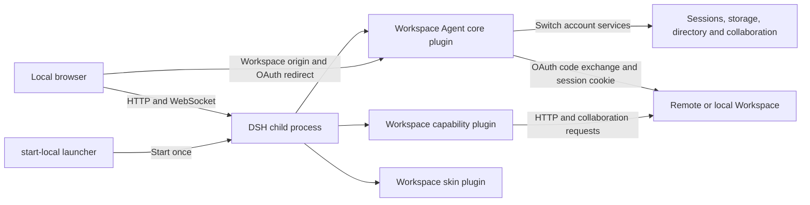
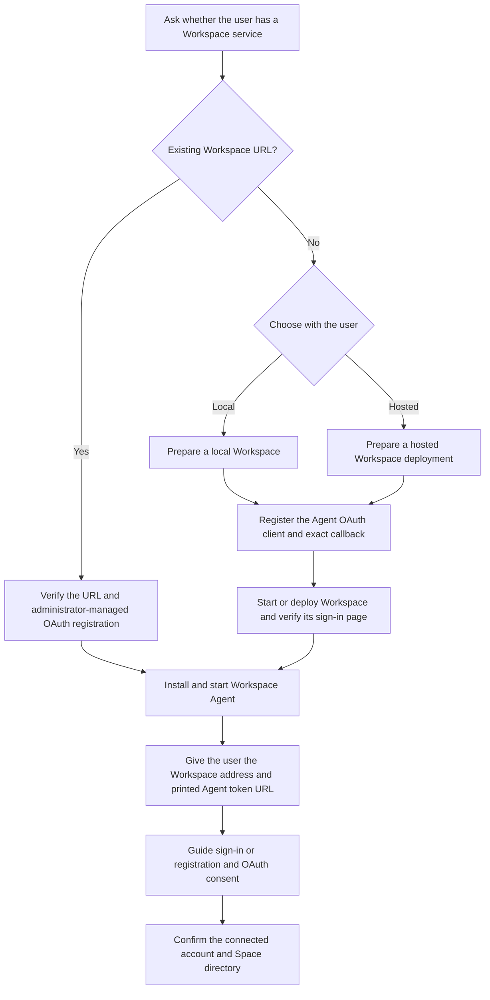

# Univer Workspace Agent

[English](README.md) | 简体中文

Univer Workspace Agent 是一个本地 Web 应用，用于与 AI Agent 讨论文档，并在 Worktree 中审查修改。
它连接一个本地或远程 Univer Workspace 服务。应用基于 DSH（DeepSeek Harness），
使用已发布的 `@deepseek-ai/*` 包组装为三个 bundle：

- `@univerjs/workspace-agent`（本包）：服务核心，负责 Workspace 浏览器 OAuth 授权、
  通过 `workspaceAuth` Cordis 服务提供进程级远程连接、Workspace 地址设置，
  以及无需重启 DSH 即可切换数据目录的账号级服务生命周期。
- `dsh-univer-workspace-plugin`：Univer 能力插件，负责 Space 与 DSH Workspace 的映射，
  以及操作远程 Workspace 文档（Unit）的 Agent 工具集。
- `dsh-univer-workspace-skin-plugin`：浏览器皮肤，使 DSH 界面与 Workspace 品牌一致。

## 安装与首次使用

Workspace Agent 运行在你的机器上，并连接 Univer Workspace 服务。两者都需要：
Workspace 存储文档并执行权限校验，Agent 提供对话和审查界面。
DSH 是下方安装命令会组装的 Agent 运行时，无需预先安装。

### 让 Agent 协助安装

即使尚未克隆仓库，也可以把下面的提示词交给你的编程 Agent：

> 帮我从 https://github.com/dream-num/univer-workspace 安装并运行 Univer Workspace Agent。先询问我是否已有 Workspace 服务及其地址。如果没有，解释本地运行和服务器部署的区别，协助我选择，再按照项目 README 启动或部署 Workspace。按照 apps/agent/README.zh-CN.md 检查前置条件、配置连接并验证启动。说明需要哪些凭据或用户操作，把 Workspace 地址和 Agent 打印的完整带 token URL 给我，引导我完成登录和授权。

Agent 应遵循[辅助安装流程](#agent-辅助安装流程)，解释选择，并确认账号和 Space 目录已加载。
Workspace 登录与模型凭据是两回事：浏览文档不需要发送模型请求，与 Agent 对话则需要模型凭据。

### 手动安装

1. 查看[环境要求和安装命令](#本地-web-客户端快速启动)，克隆仓库。
   本应用从源码构建，其私有包不是可通过 npm 单独安装的 Workspace Agent 发行版。
2. 选择 Workspace 服务。如果已有服务，请管理员注册 [Agent OAuth 客户端及回调](#连接本地-workspace)。
   如果没有，可以[在本地启动 Workspace](#连接本地-workspace)，或按照
   [Workspace 部署指南](../workspace/README.md#docker)部署。
3. 按照[本地安装命令](#本地-web-客户端快速启动)构建并启动 Agent。
   打开启动器打印的完整 token URL，然后在 **设置 → Workspace** 中连接并授权 Workspace 账号。
4. 按照[使用 Workspace Agent](#使用-workspace-agent)浏览文档、开始对话和审查变更。
   使用期间保持启动器运行。

共享的 `workspace.univer.plus` 是内部测试部署。请使用自己的 Workspace 服务完成安装。

## 职责

- 通过带 PKCE 的浏览器 OAuth 获取一个远程 Workspace Session。
  本地 Agent 没有独立的用户和权限体系；所有本地浏览器共享当前连接，远程 ACL 以 Workspace 为准。
- 向其他插件提供 `workspaceAuth`：生效的 Workspace 地址、已认证 HTTP 客户端和当前远程身份。
- 切换连接时重新加载账号所属的会话、存储和 Workspace 服务，保持 DSH 进程及本地浏览器认证运行。
- Workspace 能力路由、Viewer、模板操作和 Space 行为由消费这些能力的插件负责；本包只负责组装。
- 拥有挂载三个 bundle 及部署所需 WebServer、连接组件的组合配置。

## 运行架构

Workspace Agent 将本地 DSH 进程与远程 Workspace 服务分开。
身份、权限、Space、Node、Resource 和协同数据的权威来源仍是 Workspace。



核心插件负责连接和身份生命周期；能力插件负责 Workspace 工具及文件、文档交互；皮肤插件只负责品牌与视觉令牌。
Agent 使用 Cordis 依赖生命周期，在激活新身份前等待账号所属服务退出。
会话日志、搜索索引、附件和 Workspace 记录使用现有的“服务地址 + 用户”运行目录，切回账号即可恢复该目录。
HTTP 监听器、浏览器认证、模型凭据和设置保持运行。

每个页面携带一个连接版本。切换后，旧页面的 HTTP 请求和协同 WebSocket 升级请求会被拒绝。
其他已打开的标签页在新运行时就绪后重新加载，避免旧选择操作新账号。
业务通知通过 DSH 现有 WebSocket 多路复用连接上的逻辑 Remote 流传递。
Agent 在本地标签页之间共享一个已认证的 Workspace Worktree 事件订阅；重连会使已打开的审查视图和目录失效并重新读取，
补齐断线期间的变化。空闲标签页不轮询连接状态。
OAuth 完成和退出登录使用最长 45 秒的短时就绪检查。DSH 连接中断或旧账号请求被拒绝后，也会先检查就绪状态再重新打开应用。
切换会停止前一账号正在运行的 Agent；远程服务已接受的操作继续由 Workspace 服务端负责。

## 本地数据与存储

快速启动流程把安装文件和运行数据放在仓库外。

| 位置 | 内容 | 隔离方式 |
| --- | --- | --- |
| `UWH_DSH_BOOTSTRAP` | 已发布 DSH CLI 的隔离安装 | 本地安装共享 |
| `DSH_HOME` | Profile 元数据和打包后的插件 | 本地安装共享 |
| `UWH_DSH_DATA_HOME` | `connection.json`、按身份区分的 DSH 运行时、会话与附件数据 | 按 Workspace 地址和用户 ID 隔离运行数据 |
| `UWH_SHARED_SETTINGS_PATH` | 本地模型和界面设置，默认 `$UWH_DSH_DATA_HOME/shared/settings.yaml` | 不同身份共享 |
| `UWH_SHARED_CREDENTIALS_PATH` | DSH 模型凭据和浏览器会话签名状态，默认 `$UWH_DSH_DATA_HOME/shared/.credentials.yaml` | 不同身份共享，不保存 Workspace Session Cookie |

当前连接文件包含 Workspace 地址、非敏感用户标识，以及本地 DSH 运行时所需的服务端会话凭据。
它属于敏感本地状态，不要提交、上传或把其中的值放进问题报告。
Workspace 产品数据、协同快照及 Blob 字节仍保存在连接的 Workspace 部署中，Agent 不会把这些数据库复制到本地数据目录。

## 不负责的内容

- DSH 会话持久化与附件存储 Provider 的具体实现。
- Workspace 产品 API、Unit 数据模型或协同合同，这些归 Workspace 应用及 Univer SDK 所有。
- 对外发布合同：本包是私有 workspace package，从仓库构建后安装到 DSH Profile，不从 npm Registry 安装。

## 模型凭据

首次启动时，点击 **Continue** 关闭 DSH 测试提示。
如果只想浏览 Workspace 和审查变更，可在模型设置弹窗中选择 **Configure later**；发送 Agent 消息仍需要模型凭据。

DSH 模型设置和凭据属于本机状态，不绑定 Workspace 用户。
本地 Profile 可以在不设置 `NODE_ENV=production` 的环境下运行，或设置 `UWH_MODEL_SETTINGS_ENABLED=true`，
然后使用原生 DSH Models 页面配置。也可以在启动管理进程前设置 `DEEPSEEK_API_KEY` 或其他供应商凭据；
继承的环境变量优先生效且只读。
文件凭据 Provider 使用管理进程的共享凭据路径，因此不同账号的 DSH 运行时复用同一份模型配置。
Workspace Session Cookie 保存在独立连接状态中，不写入模型设置。

## 构建

本包的 `pnpm build` 输出 `lib/index.js`（Node 宿主 bundle）、`lib/identity.js` 和
`lib/client.js`（浏览器 bundle）。能力插件输出自己的 `lib/client.css`；
Profile 组装逻辑位于本包的 `scripts/` 和 `cordis.patch.yml`。

### 渲染与截图工具

`univer_lint` 和 `univer_screenshot` 使用固定版本的 Univer 渲染运行时，
同时需要版本匹配的静态渲染页面和兼容的 Chrome/Chromium 可执行文件。
本地快速启动命令会构建页面并设置 `UWH_RENDER_PAGE_ROOT`；如果浏览器不在 `PATH` 中，需设置 `UWH_RENDER_BROWSER`。
生产 Docker 镜像提供这两项资源。缺少 `UWH_RENDER_PAGE_ROOT` 时，工具会明确报告前置条件错误，不会声称视觉验证已通过。

能力插件使用的原生扩展保持为外部运行时依赖。Agent 镜像组装 Profile 时一次性安装对应平台的包；
运行容器只复制组装后的 Profile，不在启动时下载或编译二进制文件。

## Agent 辅助安装流程



安装前先询问用户是否已有 Workspace 服务及其浏览器地址。
如果已有，验证地址可访问且支持 Agent OAuth 客户端，并说明管理员需要修改哪些注册配置。

如果没有，解释本地和服务器部署的区别：本地 Workspace 运行在用户自己的机器上，服务器部署则需要服务器和可访问的地址。
询问用户的选择，然后按照[连接本地 Workspace](#连接本地-workspace)或
[Workspace 部署指南](../workspace/README.md#docker)操作。
克隆时使用仓库默认分支，无需检出功能分支。

开始前检查文档中的 Node.js/pnpm、包仓库、模型凭据和许可要求。
告诉用户缺少哪些凭据或配置、需要提供什么，不要假设用户有内部测试服务权限。
通过 SSH 或容器运行时，确认用户能够访问给出的 URL，并且 OAuth 回调与实际环境匹配。

交付前同时验证 Workspace 登录页和 Agent 启动。
把 Workspace 地址及 Agent 打印的完整 token URL 给用户，解释要打开哪个页面，并引导注册、登录和授权。
仅启动成功不代表安装完成，还需确认连接的账号及其 Space 目录出现。
安装命令以链接到的指南为准，避免维护多套相互偏离的命令。

## 本地 Web 客户端快速启动

使用 Node.js 24 或更新版本，以及根 `package.json` 声明的 pnpm 版本（当前为 11.24.0）。
克隆仓库后从仓库根目录安装依赖。已有 checkout 时直接使用其根目录，无需再次克隆：

```bash
git clone https://github.com/dream-num/univer-workspace.git
cd univer-workspace
pnpm install --frozen-lockfile
```

仓库的 `.npmrc` 为固定版本的 Univer SDK 选择 Registry，安装过程还需要访问公共 npm Registry 获取 DSH 包。

Agent 是本地 Web 页面，不是桌面应用。DSH CLI 必须安装在 pnpm workspace 外，
避免其 React 18 依赖树进入 Univer React 19 依赖图。从仓库根目录准备隔离的本地安装：

```bash
export UWH_LOCAL_ROOT="${XDG_CACHE_HOME:-$HOME/.cache}/univer-workspace-harness"
export UWH_DSH_BOOTSTRAP="$UWH_LOCAL_ROOT/dsh-cli"
export DSH_HOME="$UWH_LOCAL_ROOT/install"
export UWH_DSH_DATA_HOME="$UWH_LOCAL_ROOT/data"
mkdir -p "$UWH_DSH_BOOTSTRAP" "$DSH_HOME/internal-packages"
export UWA_PACKAGES="$(mktemp -d "$DSH_HOME/internal-packages/build.XXXXXX")"

npm install --prefix "$UWH_DSH_BOOTSTRAP" --save-exact \
  @deepseek-ai/dsh@0.1.5-rc.1
export DSH_BIN="$UWH_DSH_BOOTSTRAP/node_modules/@deepseek-ai/dsh/lib/bin.js"

pnpm --filter @univerjs/workspace-agent build
pnpm --filter dsh-univer-workspace-plugin build
pnpm --filter dsh-univer-workspace-skin-plugin build
pnpm --filter @univerjs/workspace-agent pack \
  --pack-destination "$UWA_PACKAGES"
pnpm --filter dsh-univer-workspace-plugin pack \
  --pack-destination "$UWA_PACKAGES"
pnpm --filter dsh-univer-workspace-skin-plugin pack \
  --pack-destination "$UWA_PACKAGES"

export DSH_PLUGINS="file:$UWA_PACKAGES/univerjs-workspace-agent-0.1.0.tgz file:$UWA_PACKAGES/dsh-univer-workspace-plugin-0.1.0.tgz file:$UWA_PACKAGES/dsh-univer-workspace-skin-plugin-0.1.0.tgz"
NPM_CONFIG_USERCONFIG="$PWD/.npmrc" ./apps/agent/scripts/build-profile.sh

# Optional but required for univer_lint and univer_screenshot.
pnpm --filter @univerjs/univer-workspace-client-core build
export UWH_RENDER_PAGE_ROOT="$PWD/packages/client-core/dist/render-runtime"
# Point this at a compatible local Chrome/Chromium binary when it is not on PATH.
export UWH_RENDER_BROWSER="${UWH_RENDER_BROWSER:-$(command -v google-chrome || command -v chromium || true)}"

node apps/agent/scripts/start-local.mjs --port 3101 \
  --no-open --trusted-host 127.0.0.1
```

保持 `start-local.mjs` 运行，它管理 DSH 子进程生命周期。
Profile 首次启动可能需要几秒钟，等待标准错误输出出现以 `dsh web:` 开头的一行。
在浏览器中打开该行打印的完整认证 URL，其中包含一次性的 `?token=...`。
DSH 会重定向到 `/` 并设置 HttpOnly 浏览器会话 Cookie。
不要把 token 放进问题报告，也不要在兑换后重复使用。
尚未完成兑换时，直接打开 `http://127.0.0.1:3101` 可能因缺少 Cookie 被拒绝；Cookie 保存后即可使用不带参数的根地址。
若 3101 被占用，选择其他明确端口，并使用相应的打印 URL。

如果 Agent 为用户启动应用，应把完整的 `dsh web:` URL 原样交给用户，让其在自己的浏览器打开。
不要改成根地址、删掉查询参数、把 token 拆到其他字段，或尝试用 API 客户端代替浏览器完成兑换。
该 token 供用户浏览器一次性使用；打开后即可使用干净的根地址。

在 **设置 → Workspace** 中填写自己的 Workspace 服务地址。本地运行时先完成下方
[连接本地 Workspace](#连接本地-workspace)，使用 `http://127.0.0.1:5173`。
共享的 `workspace.univer.plus` 是内部测试环境，不是本应用要求使用的公共服务。
首次登录使用浏览器 OAuth：点击 **Sign in to Workspace**，在 Workspace 登录或注册，然后批准 Agent 访问请求。
Workspace 重定向到本地 Agent 回调，Agent 使用 PKCE 交换一次性授权码并在服务端保存 Workspace Session。
无需设备码或手动完成按钮。授权过期时从设置重新开始登录。

Workspace 部署必须注册公共客户端 `univer-workspace-harness`，启用用户确认，允许 `identity` 和 `session` Scope，
并登记精确回调 `http://127.0.0.1:3101/auth/oauth/callback`（按实际 Agent URL 调整主机和端口）。
本地 Workspace 在启动前通过 `OAUTH_CLIENTS_JSON` 配置；参考 `apps/workspace/.env.example`。

登录后，侧栏提供 **会话 / 文件 / Worktree** 页签。
会话导航保留原生 DSH 行为；文件管理浏览当前连接的 Space/Node/Resource 树；
Worktree 列出该服务范围内的个人和团队任务，支持待处理、全部和已关闭筛选。
文件和 Worktree 在当前会话的原生右侧 Sidecar 中展示。未选择会话时，打开文件会通过原生流程复用或创建连接空间内的空会话。
在原生输入框键入 `@`，可为当前消息选择多个 Workspace Resource；
发送时会基于当前 Workspace 校验每个引用。

保存另一个 Workspace 地址只是选择下次登录的目标，需要完成浏览器授权才会激活，也可以显式断开连接。
Agent 在同一进程内重新加载账号所属服务，关闭旧协同连接，刷新目录和会话范围，不会产生新的启动 token。
完成页面会等待目标身份及本地应用就绪后再返回；重试按钮也会重新检查就绪状态，避免跳转到不可用的应用。
切换期间保持启动器运行。问题报告中不要记录密码或 `workspace_session`，只记录服务地址和非敏感账号标识。

## 使用 Workspace Agent

浏览器打开新的 token URL 并加载已授权 Workspace 身份后：

1. 在侧栏打开 **会话**，选择 **新会话**，在右侧原生输入框发送消息。
   调用模型还需要本地 DSH 模型凭据；Workspace 登录只授权 Workspace 数据。
2. 打开 **文件**，选择个人或团队 Space，通过 **新建** 创建文件夹或 Univer 文档。
   同一菜单支持上传文件；受支持的 Office 文件会导入为 Univer Resource。
3. 在树中选择 Univer Resource，在原生右侧 Sidecar 打开 Viewer，对话保持可见。
   返回 **会话** 只改变左侧导航，不应关闭 Viewer。
4. 使用文件行菜单执行 Workspace 授予的操作，例如重命名、移动、分享、复制链接或移入回收站。
   菜单按能力展示，只读共享 Resource 的操作会更少。
5. 打开 **Worktree** 查看个人或团队任务。默认展示待处理任务；选择 **All** 包含已关闭任务，
   或 **Closed only** 只看已关闭任务，然后选择任务打开 Changes 审查界面。
6. 在对话消息中键入 `@`，选择 **Browse Workspace** 引用远程文档或文件夹，
   或选择 **Local files** 引用 Agent 所在机器的文件和文件夹。可以反复选择以添加多个引用。
   文档或文件夹行的 **加入消息** 操作也会添加到当前对话。仅打开文档不会自动加入消息上下文。
   路径输入方式及引用与上传的区别见[文件与文件夹引用](#文件与文件夹引用)。
7. 测试其他服务或身份时，在 **设置 → Workspace** 保存或授权新连接。
   Agent 无需重启 DSH 即可切换账号所属服务及数据目录。
   确认新身份拥有自己的会话与目录，切回原身份后能够恢复原历史。

### 审查变更与保留会话

让 Agent 修改文档后，在合入前检查生成的 Worktree。
审查视图展示新增、修改和删除的文档；选择条目查看内容，准备好后使用合入或丢弃操作。
Worktree 选择器用于切换相关 Worktree，文档列表展示当前所选 Worktree 的内容。

使用 **隐藏会话** 为文档释放空间，同时保留 Session 和草稿。
**显示会话** 或 **加入消息** 可以再次展开。书签和刷新行为见[区域导航](#区域导航)。

排查对话问题时，使用标题栏中的 **Session 日志（Session log）** 下载包含当前 Session、子 Session 和附件的 ZIP。
标题栏在发送第一条消息后出现。确认浏览器完成下载；“已开始下载”提示本身不能证明下载成功。
分享前检查压缩包内容，因为其中可能包含对话内容和本地附件。

## 连接本地 Workspace

无需内部测试服务权限，也能在本地运行完整应用。
Workspace 默认**不会**注册 Agent OAuth 客户端；仅复制 `.env.example` 不够，因为 OAuth 示例被注释了。
在启动 Workspace 服务端前完成以下配置。

1. 从仓库根目录创建配置文件。已有 `.env` 时编辑现有文件，不要覆盖。

   ```bash
   cp apps/workspace/.env.example apps/workspace/.env
   ```

2. 在 `apps/workspace/.env` 中加入以下未注释的单行配置：

   ```dotenv
   OAUTH_CLIENTS_JSON={"clients":[{"clientId":"univer-workspace-harness","clientType":"public","requiresConsent":true,"redirectUris":["http://127.0.0.1:3101/auth/oauth/callback"],"scopes":["identity","session"]}]}
   ```

   如果已有 `OAUTH_CLIENTS_JSON`，把客户端添加到其 `clients` 数组，保留其他客户端且只保留一个配置项。
   这是使用 PKCE 和显式用户确认的公共 OAuth 客户端，不需要客户端密钥。
   应用改名后客户端 ID 仍为 `univer-workspace-harness`。

3. 分别在两个终端启动 Workspace 后端与浏览器开发服务：

   ```bash
   pnpm workspace:dev:server
   ```

   ```bash
   pnpm workspace:dev:web
   ```

4. 打开 `http://127.0.0.1:5173` 注册本地 Workspace 账号或登录现有账号。
   本地注册不需要 GitHub 或 Discord OAuth 凭据。保持两个 Workspace 进程运行。
5. 按照上方[本地安装命令](#本地-web-客户端快速启动)在 3101 启动 Agent，打开完整 token URL。
   在 **设置 → Workspace** 中设置 `http://127.0.0.1:5173`，点击 **Sign in to Workspace**，
   在本地 Workspace 授权页批准访问。返回后，侧栏应出现账号及个人 Space，此时可以创建会话、浏览和引用文档。

| 地址 | 用途 |
| --- | --- |
| `http://127.0.0.1:3101` | Agent 界面和 OAuth 回调 |
| `http://127.0.0.1:5173` | Workspace 浏览器界面及 Agent 中填写的服务地址 |
| `http://127.0.0.1:3020` | Workspace 后端，Vite 将 API 和协同请求转发到这里 |

回调 URL 必须精确匹配：`localhost` 和 `127.0.0.1` 属于不同注册。
修改 Agent 主机或端口后，要同步修改 `redirectUris` 并重启 Workspace 后端。
这项注册控制的是 OAuth 回调，不是对 3101 端口的通用 CORS 放行。

`OAUTH_CLIENT_UNAVAILABLE` 表示服务端未加载请求的客户端，请检查配置是否生效并重启后端。
`INVALID_REDIRECT_URI` 表示请求的回调未注册。
只有 Workspace Browser 已构建到 `apps/workspace/dist/public` 后，才能将 3020 作为服务地址。
新克隆的仓库使用 5173，确保登录与授权页面可用。

## 故障排查

- **直接打开本地根地址返回 HTTP 401：** 先打开一次 DSH 打印的认证 URL。浏览器保存会话 Cookie 后即可使用根地址。
- **连接页面持续等待：** 保持 `start-local.mjs` 运行。如有 **Check again**，点击后会验证就绪状态再返回。
  账号服务加载失败时查看启动器日志。
- **Workspace 登录成功但模型消息失败：** Workspace OAuth 只授权 Workspace 数据，需另行配置本地 DSH 模型凭据。
- **授权请求过期：** 从 **设置 → Workspace** 重新登录。本应用使用浏览器 OAuth、PKCE 和用户确认，不要求输入 CLI 设备码。
- **Session 日志下载报 `workspace_connection_changed`：** 更新本地 Profile 后刷新 Agent，再使用 **Session log** 下载。
  按钮会携带页面连接版本；复制不带版本的 `/api/session.export` 地址无法通过账号隔离检查。
- **Viewer 不可用：** 确认当前账号能读取该 Resource，修改插件源码后已重新构建 Profile。
- **目录仍显示旧账号：** 等待授权后的页面刷新。若持续存在，记录服务地址和账号名称用于诊断，保留本地数据目录与会话历史。

问题报告中不要放密码、Workspace Session Cookie、设备码或模型 API Key。
记录 Workspace 地址、本地 Agent 端口、Profile 名称和非敏感账号标识即可。

## 区域导航

文件和 Worktree 共用每个会话的一个 Workspace 预览标签页；点击其他文件切换内容，
重复点击会重新显示或打开标签页。缩放、分屏、全屏和关闭由 DSH 原生 Sidecar 管理。
Sidecar 布局状态按会话保留在内存中。Worktree 标签显示任务标题和状态，已合入 Worktree 默认展示“差异”，其他状态默认展示“修改效果”，用户可主动切换。
标题和操作始终同行：宽容器显式展示“关闭”，较窄时收进更多菜单；“转为草稿”始终在菜单内，“合入”保持为主操作。
对话中的文件行和悬浮任务列表只负责打开 Sidecar，不再内嵌文档预览。悬浮窗显示各 Worktree 的新增、修改、删除文件数，可在整个浏览器窗口内拖拽。
旧 `center=resource/...`、`center=blob/...` 和
`center=worktree/...` 链接继续请求预览，但内容现在显示在 Sidecar 内，不再创建中间分栏或隐藏对话。

## 文件与文件夹引用

键入 `@` 选择 Workspace 文档、**Browse Workspace** 或 **Local files**。
浏览 Workspace 时点击文件夹名称会引用文件夹，使用箭头或 Tab 浏览其子项。
文件夹引用保留 Space 和 Node 身份，发送时按当前 Workspace 权限再次校验。

**Local files** 浏览 Agent 所在机器的文件系统。使用 SSH 转发或远程安装时，它可能不是浏览器所在机器。
选择该入口逐层浏览目录，或粘贴完整的 `@/absolute/path`、`@~/Downloads/` 查询。
选择文件或文件夹会插入行内引用，使用文件夹箭头或 Tab 进入子目录。
含空格的路径可以在 `@"` 后输入，目录导航会处理引号。
目录补全数量有上限；菜单提示还有更多条目时，缩小路径前缀。
当前 DSH 编辑器逐字输入路径时可能让建议停留在上一目录，此时请使用目录导航或粘贴完整查询。

本地引用是真实宿主路径，不是上传副本。引用本身不会上传、读取或递归展开文件/文件夹，
也不会额外授予 Agent 文件系统权限。发送消息时会再次检查路径丢失、文件类型变化或 Workspace 权限撤销。
本功能不包含操作系统文件拖拽上传。

Workspace 文档类型作为展示元数据保留在引用链接中，因此消息历史可以显示类型图标，无需逐个请求被引用文档。
原生 DSH 输入框目前只提供通用文件和文件夹图标，其公开引用合同不支持逐文档类型的图标。

## 稳定运行标识

应用名为 Univer Workspace Agent，私有包名为 `@univerjs/workspace-agent`。
DSH Profile、设置命名空间、OAuth 客户端 ID 和现有缓存目录仍使用 `univer-workspace-harness` 作为稳定内部标识。
应用改名不会搬迁账号数据、重置会话或要求重新注册 OAuth 客户端。

如果本地 Profile 创建于包改名前，在执行上方安装命令前移除旧核心 bundle：

```bash
node "$DSH_BIN" plugin --profile univer-workspace-harness remove @univerjs/univer-workspace-harness
```

该命令移除旧安装包，不删除 Profile 账号数据。保持原有 `DSH_HOME` 和 `UWH_DSH_DATA_HOME`，再安装三个当前 bundle。

每次本地重新构建都使用新的包目录，如上方命令所示。
重复使用同一 tarball 路径和版本号，可能让 pnpm 在文件内容已变化时仍复用旧缓存 bundle。
