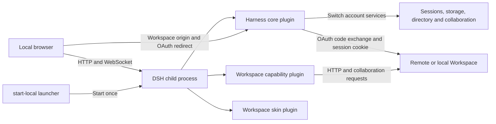

# @univerjs/univer-workspace-harness

Univer Workspace Harness is a local DSH (DeepSeek Harness) Web client for one
local or remote Univer Workspace connection. It is assembled from published
`@deepseek-ai/*` packages and shipped as three DSH bundles that a local dsh
profile loads:

- `@univerjs/univer-workspace-harness` (this package) — the service core:
  Workspace browser OAuth authorization, one process-wide remote
  connection exposed through the `workspaceAuth` cordis service, the
  Workspace origin settings namespace, and account-scoped service lifecycles
  that switch data directories without restarting DSH.
- `dsh-univer-workspace-plugin` — the Univer capability plugin: space ↔
  dsh-workspace reconciliation and the agent toolset operating remote
  Workspace Units.
- `dsh-univer-workspace-skin-plugin` — the browser skin aligning the DSH UI
  with the Workspace brand.

## Responsibilities

- Obtain one remote Workspace session through browser OAuth with PKCE. The local
  Harness has no users or permissions of its own; every local browser uses the
  same current connection and Workspace remains authoritative for remote ACLs.
- Provide `workspaceAuth` to sibling plugins: effective Workspace origin,
  authenticated HTTP client, and current remote identity.
- Keep the DSH process and local browser authentication running while a
  connection change reloads account-owned sessions, storage and Workspace services.
- Keep Workspace capability routes, Viewer UI, template actions, and Space
  behavior in the consuming plugins; this package only composes them.
- Own the composition patch that mounts the three bundles and the deployment
  webserver/connection rows.

## Runtime architecture

The Harness keeps the local DSH process separate from the remote Workspace
service. Workspace remains the authority for identity, permissions, Spaces,
Nodes, Resources, and collaboration data.



The core plugin owns connection and identity lifecycle. The capability plugin
owns Workspace tools and file/document interactions. The skin plugin only owns
branding and visual tokens. The Harness uses Cordis dependency lifecycles to drain
account-owned services before activating the new identity. Session logs, search
indexes, attachments and Workspace records use the existing origin-and-user
runtime directory; switching back restores that directory. The HTTP listener,
browser authentication, model credentials and settings remain running.

Each rendered page carries a connection version. HTTP requests and collaboration
WebSocket upgrades from an old page are rejected after a switch. Other open tabs
reload when the new runtime is ready, so their old selections cannot operate on
the new account. Business notifications use a logical Remote stream on DSH's
existing WebSocket mux. The Harness shares one authenticated Workspace Worktree
feed across local tabs; a reconnect invalidates the open review views and directory
so missed changes are fetched again. Idle tabs do not poll connection status.
OAuth completion and logout use short readiness checks for at most 45 seconds.
A lost DSH connection or rejected stale-account request also checks readiness
before reopening the application. Switching stops the previous account's active agent runtime;
already accepted remote operations remain owned by the Workspace server.

## Local data and storage

The quick start keeps installation and runtime data outside the repository.

| Location | Contents | Isolation |
| --- | --- | --- |
| `UWH_DSH_BOOTSTRAP` | Isolated installation of the published DSH CLI | Shared by the local installation |
| `DSH_HOME` | Profile metadata and packaged plugin bundles | Shared by the local installation |
| `UWH_DSH_DATA_HOME` | `connection.json`, identity-specific DSH runtimes, and local session/attachment data | Runtime data is separated by Workspace origin and user id |
| `UWH_SHARED_SETTINGS_PATH` | Local model and interface settings; defaults to `$UWH_DSH_DATA_HOME/shared/settings.yaml` | Shared across identities |
| `UWH_SHARED_CREDENTIALS_PATH` | DSH model credentials and browser-session signing state; defaults to `$UWH_DSH_DATA_HOME/shared/.credentials.yaml` | Shared across identities; never contains Workspace session cookies |

The active connection file contains the Workspace origin, a non-secret user
identity, and the server-side session credential required by the local DSH
runtime. Treat the file as sensitive local state. Do not commit it, upload it,
or include its values in bug reports. Workspace product data, collaboration
snapshots, and Blob bytes remain in the connected Workspace deployment; the
Harness does not copy those databases into its local data directory.

## Non-responsibilities

- DSH session persistence and attachment storage specialization (a
  deployment provides its own provider; Internal DSH ships the S3 one).
- Workspace product APIs, the Unit data model, or collaboration contracts —
  those stay in the Workspace application and the Univer SDKs.
- Any publication contract: this is a private workspace package, installed
  into a dsh profile from the repository build, never from the npm registry.

## Model credentials

On first launch, dismiss the DSH testing notice with **Continue**. The model
setup dialog offers **Configure later** if you only want to browse Workspace
and review changes; sending agent messages still requires model credentials.

DSH model settings and credentials are local-machine state; they are not tied
to a Workspace user. For a local profile, run without `NODE_ENV=production` or
set `UWH_MODEL_SETTINGS_ENABLED=true`, then configure the stock DSH Models page.
You can instead export `DEEPSEEK_API_KEY` or another provider credential before
starting the supervisor; an inherited environment value wins and is read-only.
The file-backed credential provider uses the supervisor's shared credentials
path, so identity-specific DSH runtimes reuse the same model configuration.
Workspace Session Cookies stay in the separate connection state and are never
written to model settings.

## Build

`pnpm build` emits `lib/index.js` (node host bundle), `lib/identity.js`, and
`lib/client.js` (browser bundle). The capability plugin emits its own
`lib/client.css`; profile assembly lives in this package's `scripts/` and
`cordis.patch.yml`.

### Render and screenshot tools

`univer_lint` and `univer_screenshot` use the pinned Univer render runtime.
They require both the version-matched static render page and a compatible
Chrome/Chromium executable. The local quick start builds the page and exports
`UWH_RENDER_PAGE_ROOT`; set `UWH_RENDER_BROWSER` when the browser executable is
not discoverable on `PATH`. The production Docker image supplies both assets.
If `UWH_RENDER_PAGE_ROOT` is missing, the tools return an explicit prerequisite
error and do not claim that visual verification passed.

Native addons used by the capability plugin remain external runtime
dependencies. The Harness image installs the platform-specific packages once
while assembling the profile; the runtime container only copies that assembled
profile and does not download or compile binaries during startup.

## Local Web client quick start

Use Node.js 24 or newer and the pnpm version declared in the root
`package.json` (currently 11.24.0). Start from a clone of this repository and
install its dependencies from the repository root:

```bash
pnpm install --frozen-lockfile
```

The checked-in `.npmrc` selects the registry for the pinned Univer SDK release.
The installation also needs access to the public npm registry for DSH packages.

The Harness is a local Web page, not a desktop application. The DSH CLI must be
installed outside this pnpm workspace so its React 18 dependency tree does not
enter the Univer React 19 graph. From the repository root, prepare one isolated
local installation:

```bash
export UWH_LOCAL_ROOT="${XDG_CACHE_HOME:-$HOME/.cache}/univer-workspace-harness"
export UWH_DSH_BOOTSTRAP="$UWH_LOCAL_ROOT/dsh-cli"
export DSH_HOME="$UWH_LOCAL_ROOT/install"
export UWH_DSH_DATA_HOME="$UWH_LOCAL_ROOT/data"
mkdir -p "$UWH_DSH_BOOTSTRAP" "$DSH_HOME/internal-packages"

npm install --prefix "$UWH_DSH_BOOTSTRAP" --save-exact \
  @deepseek-ai/dsh@0.1.2-alpha.4
export DSH_BIN="$UWH_DSH_BOOTSTRAP/node_modules/@deepseek-ai/dsh/lib/bin.js"

pnpm --filter @univerjs/univer-workspace-harness build
pnpm --filter dsh-univer-workspace-plugin build
pnpm --filter dsh-univer-workspace-skin-plugin build
pnpm --filter @univerjs/univer-workspace-harness pack \
  --pack-destination "$DSH_HOME/internal-packages"
pnpm --filter dsh-univer-workspace-plugin pack \
  --pack-destination "$DSH_HOME/internal-packages"
pnpm --filter dsh-univer-workspace-skin-plugin pack \
  --pack-destination "$DSH_HOME/internal-packages"

export DSH_PLUGINS="file:$DSH_HOME/internal-packages/univerjs-univer-workspace-harness-0.1.0.tgz file:$DSH_HOME/internal-packages/dsh-univer-workspace-plugin-0.1.0.tgz file:$DSH_HOME/internal-packages/dsh-univer-workspace-skin-plugin-0.1.0.tgz"
NPM_CONFIG_USERCONFIG="$PWD/.npmrc" ./apps/harness/scripts/build-profile.sh

# Optional but required for univer_lint and univer_screenshot.
pnpm --filter @univerjs/univer-workspace-client-core build
export UWH_RENDER_PAGE_ROOT="$PWD/packages/client-core/dist/render-runtime"
# Point this at a compatible local Chrome/Chromium binary when it is not on PATH.
export UWH_RENDER_BROWSER="${UWH_RENDER_BROWSER:-$(command -v google-chrome || command -v chromium || true)}"

node apps/harness/scripts/start-local.mjs --port 3101 \
  --no-open --trusted-host 127.0.0.1
```

Keep `start-local.mjs` running: it owns the DSH child process lifetime.
The first profile start can take several seconds while DSH loads the profile;
wait until stderr prints a line beginning with `dsh web:`. Open that exact
authenticated URL, which contains a one-time `?token=...` query, in the
browser. DSH responds with a redirect to `/` and sets an HttpOnly browser
session cookie. Do not copy the token into a bug report or reuse it after the
exchange. The bare `http://127.0.0.1:3101` may be rejected before this
exchange because no DSH browser session cookie exists yet; after the cookie is
stored, the clean root URL works. If port `3101` is occupied, choose another
explicit port and use the matching printed URL.

If an agent is starting the Harness for a human, pass the complete `dsh web:`
URL to the human exactly as printed and ask them to open it in their browser.
Do not replace it with the bare root URL, remove the query string, put the token
in another message field, or attempt to complete the browser exchange through
an API client. The token is intended for the user's browser and is consumed
once; after the user opens it, the browser can use the clean root URL.

In Settings → Workspace, set the service origin (for the shared test environment use
`https://workspace.univer.plus`; a local Workspace URL works as well). The first
login uses browser OAuth: click “Sign in to Workspace”, sign in or register on
Workspace, then approve the Harness access request. Workspace redirects to the
local Harness callback; the Harness exchanges the one-time code using PKCE and
stores the resulting Workspace session server-side. No device code or manual
completion button is needed. If the request expires, start a new login from Settings.

The Workspace deployment must register the public client
`univer-workspace-harness` with consent enabled, scopes `identity` and `session`,
and the exact callback `http://127.0.0.1:3101/auth/oauth/callback` (adjust the
host and port to your Harness URL). For a local Workspace, configure this client
through `OAUTH_CLIENTS_JSON` using `apps/workspace/.env.example` before startup.


After login, the left sidebar exposes the implemented **Sessions / Files / Worktree**
tabs. Session navigation keeps the native DSH behavior, Workspace file
management browses the connected Space/Node/Resource tree, and Worktree lists
origin-level personal/team tasks with open/all/closed filtering. Open or create
a file independently of conversations. Opening a file inserts its Viewer in the
center while the right side remains the same native DSH conversation; it does
not create a second conversation, composer, or fixed conversation tab. In the
native composer, type `@` to choose one or more Workspace Resources for the
current message; each reference is checked against the connected Workspace when
the message is sent.
Saving a different Workspace origin selects the destination for the next login.
Complete browser authorization to activate it, or explicitly disconnect. The
Harness then reloads account-owned services inside the same process, closes old
collaboration connections and refreshes the directory and session scope. There
is no new launch token to open. The completion page waits for the selected
identity and local application to be ready before returning; its retry button
checks readiness again instead of navigating into an unavailable application.
Keep the launcher running throughout the switch.
Never record passwords or `workspace_session` values in bug reports; record only
the origin and a non-secret account identifier.

### First end-to-end check

Once the browser has opened the new token URL and loaded the authorized
Workspace identity:

1. Open **Sessions** in the left sidebar and select **New session**. Type a message in
   the native composer on the right. Sending to a model also requires a local
   DSH model credential; Workspace login only authorizes Workspace data.
2. Open **Files**, select a Personal or Team Space, then use **New** to create
   a folder or Univer document. The same menu accepts file uploads; supported
   Office files are imported as Univer Resources.
3. Select a Univer Resource in the tree. Its full-height Viewer opens in the
   middle, while the current native DSH conversation stays on the right. Going
   back to **Sessions** changes only the left navigation and must not close the
   Viewer.
4. Use a file row's action menu for the capabilities granted by Workspace,
   such as rename, move, share, copy link, or move to trash. The menu is
   capability-aware; a shared read-only Resource intentionally exposes fewer
   actions.
5. Open **Worktree** to find personal or team tasks. The default view shows
   open tasks; choose **All** to include closed tasks or **Closed only** to show
   only closed tasks, then select a task to open its Changes review surface.
6. In a native conversation message, type `@`, choose **Browse Workspace** when
   the file is not in the recent suggestions, navigate Space → folder → file,
   and repeat to add multiple Resources before sending. The resulting message
   carries stable Resource identities; opening a file alone does not silently
   add it to the message context.
7. To test another Workspace service or identity, return to **Settings →
   Workspace** and save or authorize the new connection. The Harness
   switches account-owned services to the matching data directory without
   restarting DSH. Verify that the new identity receives its own conversations
   and directory, and that switching back restores the original history.

## Connect to a local Workspace

The Harness accepts any Workspace HTTP origin. To run the Workspace application
from this repository, use a second terminal and follow the Workspace application
guide:

```bash
cp apps/workspace/.env.example apps/workspace/.env
pnpm workspace:dev:server
```

The API server listens on `http://127.0.0.1:3020` by default. Browser authorization
also needs the Workspace sign-in UI: run `pnpm workspace:dev:web` in another
terminal, then set the Harness Workspace origin to `http://127.0.0.1:5173`.
Vite serves the sign-in UI and forwards API and collaboration requests to port
3020. Register the Harness OAuth client in `OAUTH_CLIENTS_JSON` before starting
the server, as described above; its callback must match the Harness port.

Port 3020 can be used directly when the Workspace Browser has been built into
`apps/workspace/dist/public`. On a fresh clone without that build, using port
3020 as the authorization origin leaves the login page unavailable. The Harness
does not create Workspace users or bypass Workspace authentication.

## Troubleshooting

- **The bare local URL returns HTTP 401:** open the authenticated URL printed by
  DSH once. After the browser stores the DSH session cookie, the root URL works.
- **The connection page is still waiting:** keep `start-local.mjs` running.
  Use **Check again** if offered; it verifies readiness before returning.
  Inspect the launcher log if account services fail to load.
- **Workspace login succeeds but model messages fail:** Workspace Device
  Authorization only grants Workspace data access. Configure a local DSH model
  credential separately.
- **The device code expires:** start a new authorization request. Device codes
  are single-use and are not persisted in the browser.
- **The Viewer is unavailable:** confirm that the connected account can read the
  Resource and that the profile was rebuilt after changing plugin source.
- **The directory still shows the previous account:** let the page refresh
  after authorization. If it persists, record the service origin and account
  names for diagnosis; preserve the local data directory and session history.

Do not put passwords, Workspace session cookies, device codes, or model API keys
in bug reports. Record the Workspace origin, local Harness port, profile name,
and a non-secret account identifier instead.

This is the currently implemented first-version path. Formal Recent/Shared
file surfaces and the final two-identity new-user acceptance matrix remain tracked in
the repository's local development notes
and must not be presented as available until their UI and browser acceptance
are complete.

## Region navigation

The URL independently records the middle document/review region (`center`) and
the conversation region (`right`), for example
`#/?center=worktree%2Freview-id&right=session%2Fsession-id`. Closing the middle region
preserves the conversation. Hiding the conversation releases its screen space
while retaining its selected Session and draft; the `right` value becomes
`hidden/session/<session-id>`. **Show conversation**, selecting a Session, or
successfully adding a document to the current message expands it again. Hiding
does not delete a Session or cancel its agent. Browser history and refresh
restore both the selection and visibility. An empty route shows the new-session
composer. Existing
`#/s/<session-id>` links still open their conversation. Document names and
permissions are resolved from the connected Workspace, not stored in the URL.


## File and folder mentions

Type `@` to choose a Workspace document, **Browse Workspace**, or **Local files**.
In Workspace browsing, click a folder name to reference that folder; use its
arrow or Tab to browse its children. Folder references retain the Space and Node
identity and are checked against current Workspace access when sending.

**Local files** browses the filesystem of the machine running Harness. This may
be a different machine from the browser when using SSH forwarding or a remote
installation. Select **Local files** to browse one directory at a time, or paste
a complete `@/absolute/path` or `@~/Downloads/` query. Select a file or folder to insert an inline
reference. Use a folder's arrow or Tab to descend into it. Paths containing
spaces can be entered after `@"`; directory navigation handles quoting for you.
Directory completion is bounded; narrow the path prefix if the menu reports
that additional entries exist. The current DSH editor can leave path suggestions
on a previous directory during character-by-character path entry; use directory
navigation or paste the complete query if that occurs.

Local references contain real host paths, not uploaded copies. Referencing does
not upload, read, or recursively expand a file or folder, and does not grant the
agent additional filesystem permissions. Missing paths, changed file types, or
revoked Workspace access are checked again when the message is sent. Operating
system drag-and-drop upload is not part of this feature.

Workspace document types are retained as display metadata in reference links.
Message history can therefore show a type-specific icon without fetching every
referenced document. The native DSH composer currently exposes generic file and
folder icons; its public reference contract does not expose per-document icons.
