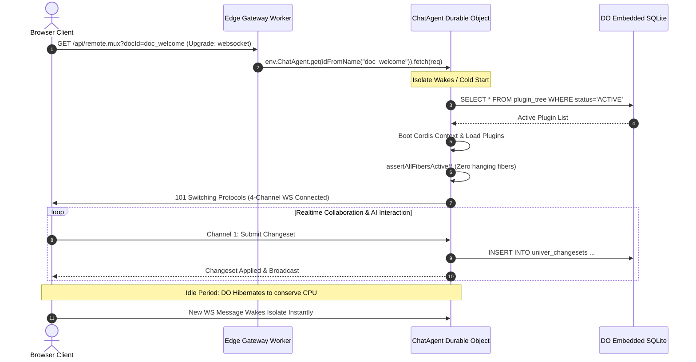

# Univer Workspace: Cloudflare Edge Architecture Blueprint

This blueprint defines the technical architecture of **Univer Workspace** running as a **100% serverless, zero-container system on Cloudflare Edge Workers, Durable Objects, D1, R2, and Static Assets**.

---

## 1. System Topology & Core Principles

The architecture follows a strict zero-container, edge-native microkernel model inspired by [`agent-think-cordis`](file:///home/gabriel/Documentos/agent-think-cordis). There are no Node.js servers, external Docker containers, or background VMs. All computation executes within V8 isolates at Cloudflare edge locations worldwide.

```mermaid
flowchart TB
    subgraph Clients["Clients"]
        Browser["Workspace Browser (React 19 SPA)"]
        AgentUI["Workspace Agent UI"]
        CLI["Workspace CLI / Automated Agents"]
    end

    subgraph EdgeWorkers["Cloudflare Edge Worker Gateway (src/server.ts)"]
        Router{"Edge Router & Auth Guard"}
        StaticAssets["Workers Static Assets (SPA Bundle)"]
    end

    subgraph ControlStorage["Global Control Plane & Blob Storage"]
        D1DB[("Cloudflare D1 (SQLite)\nControl Plane DB")]
        R2Bucket[("Cloudflare R2 Bucket\nBlob & Asset Store")]
    end

    subgraph SpaceLayer["Space Realtime Layer (Per Space)"]
        WSDO["WorkspaceDO (Durable Object)\n- Presence & Cursor Sync\n- Tree Mutation Broadcast\n- Hibernatable WebSockets"]
    end

    subgraph DocumentLayer["Document & AI Agent Layer (Per Document / Unit)"]
        ChatAgentDO["ChatAgent (Durable Object)\n- Cordis v4 Microkernel\n- Embedded SQLite Storage\n- Universal Action Engine\n- 4-Channel Remote Mux\n- Univer Collab OT Engine\n- Worktree Draft Sandboxing"]
    end

    Browser -->|HTTP GET (Static Assets)| StaticAssets
    Browser -->|HTTP REST /api/auth, /api/spaces, /api/nodes| Router
    AgentUI -->|HTTP REST & WS| Router
    CLI -->|HTTP REST & RPC| Router

    Router -->|Authenticate & Query CRUD| D1DB
    Router -->|Stream Uploads & Range Reads| R2Bucket

    Router -->|WS /spaces/:spaceId/live| WSDO
    Router -->|WS /api/remote.mux?docId=:id| ChatAgentDO
    Router -->|HTTP /universer-api/*?unitId=:id| ChatAgentDO
```

### Core Design Principles

1. **Zero Docker Containers**: The entire backend compiles into standard Cloudflare Worker scripts and Durable Objects. No Docker daemons, Kubernetes pods, or long-running virtual machines are needed.
2. **Cordis Microkernel in Durable Objects**: Extensibility is achieved via Cordis v4 running directly inside Cloudflare Durable Object isolates. Plugins, services, and action handlers dynamically load and unload inside the isolate.
3. **Synchronous In-Memory SQLite per Document**: Each `ChatAgent` and `WorkspaceDO` owns a dedicated, persistent, transactional SQLite database provided by Cloudflare's `this.ctx.storage.sql`. Queries execute in under 1ms synchronously.
4. **Relational Control Plane in D1**: Cross-document, workspace-wide metadata (users, password hashes, login sessions, tree structures, spaces, trash lifecycle, and worktree references) lives in Cloudflare D1.
5. **Byte-Range Streaming in R2**: Heavy assets (images, spreadsheets, PDFs, attachments) are stored in Cloudflare R2 with streaming chunk uploads and HTTP byte-range slicing.
6. **Hibernatable WebSockets**: Realtime connections hibernate when idle, conserving compute time and scaling seamlessly to thousands of concurrent users.

---

## 2. Component Decomposition

| Component | Technology | Scope / Granularity | Key Responsibilities |
| :--- | :--- | :--- | :--- |
| **Edge Gateway** | Cloudflare Workers (`src/server.ts`) | Global Single-Origin Entrypoint | Routing, CORS handling, authentication token validation, SPA static asset fallback, binding orchestration. |
| **Control Plane** | Cloudflare D1 SQLite (`src/control-plane/`) | Global Workspace Tenant | User accounts, PBKDF2 authentication, sessions, space memberships, hierarchical file/folder tree, trash batches, worktrees. |
| **Blob Store** | Cloudflare R2 (`src/integrations/r2-blob-store.ts`) | Global Asset Bucket | Chunked binary uploads, SHA-256 integrity verification, MIME detection, HTTP range request streaming (`Range: bytes=x-y`). |
| **WorkspaceDO** | Cloudflare Durable Object (`src/project/workspace-do.ts`) | Sharded by `spaceId` | Hibernatable WebSockets for workspace-wide tree change notifications (`tree.node.*`) and active collaborator presence (`presence.update`). |
| **ChatAgent DO** | Cloudflare Durable Object (`src/project/dsh-host.ts`) | Sharded by `docId` / Unit | Cordis v4 microkernel runtime, 4-channel WebSocket multiplexer, Univer OT collaboration suite (`/universer-api/*`), and Universal Action Engine. |

---

## 3. Durable Object Isolate Lifecycle

Cloudflare Durable Objects provide guaranteed single-instance execution per entity ID with persistent state.



### Isolate Wake & Microkernel Reconstitution
1. When an HTTP or WebSocket request arrives at the Worker gateway, `env.ChatAgent.get(idFromName(docId))` locates or instantiates the Durable Object on the nearest Cloudflare PoP.
2. In `constructor(ctx, env)`:
   - Synchronous DDL migrations run against `ctx.storage.sql` to ensure tables (`plugin_tree`, `univer_units`, `univer_snapshots`, `univer_changesets`, `worktrees`, `action_journal`) exist.
   - Initial document structures are seeded if newly created.
3. In `ensureKernel()`:
   - A fresh Cordis `Context` is instantiated.
   - Core services (`sql`, `tree`, `action`, `workspace`, `chat`) are registered.
   - All plugins recorded as `ACTIVE` in `plugin_tree` are loaded sequentially.
   - `assertAllFibersActive()` verifies every Cordis fiber started successfully.

---

## 4. Multi-Tenant Edge Data Partitioning

| Data Domain | Storage Location | Schema / Format | Consistency Guarantee |
| :--- | :--- | :--- | :--- |
| **Users & Authentication** | Cloudflare D1 | SQL (`users`, `sessions`) | Strong read-after-write per region |
| **Space & Tree Hierarchy** | Cloudflare D1 | SQL (`spaces`, `nodes`, `space_members`) | Strong consistency |
| **Trash & Worktree Metadata** | Cloudflare D1 | SQL (`trash_batches`, `worktrees`) | Strong consistency |
| **Document OT Snapshots & Changesets** | ChatAgent DO SQLite | SQL (`univer_snapshots`, `univer_changesets`) | Strict linearizable per document |
| **Cordis Plugin Tree & Action Journal** | ChatAgent DO SQLite | SQL (`plugin_tree`, `action_journal`) | Strict linearizable per document |
| **Presence & Cursor State** | WorkspaceDO Memory | Ephemeral In-Memory + WebSocket Sessions | Realtime eventual broadcast |
| **File & Attachment Blobs** | Cloudflare R2 | S3-compatible Object Storage | Strong read-after-write consistency |

---

## 5. Security & Isolation Model

- **Memory Isolation**: Each document operates in its own V8 isolate via Durable Objects. Memory leaks or runtime errors in one workbook cannot crash other documents or the gateway.
- **WebCrypto Auth**: Password hashing uses PBKDF2 with 100,000 iterations of SHA-256 and cryptographically random 32-byte salts. Session tokens are 256-bit cryptographically secure random strings hashed with SHA-256 before database insertion.
- **HTTP Cookies**: Authenticated sessions set `workspace_session` cookies with `HttpOnly`, `SameSite=Lax`, and `Secure` attributes.
- **Network Boundaries**: No internal network ports or private VPCs are exposed. Communication between the gateway and Durable Objects is internal to the Cloudflare network fabric via DO RPC.
