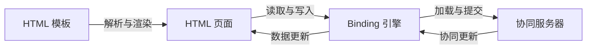
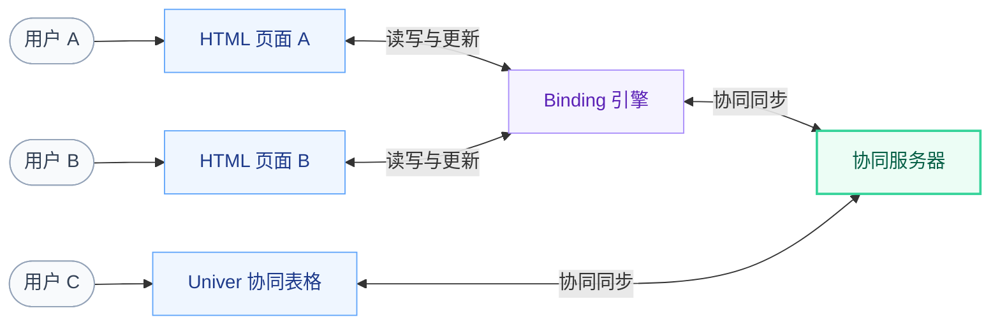

# Univer HTML Views

Univer HTML Views 是基于 Univer SDK 的 HTML 数据视图能力。它将 HTML 页面与
Univer 数据绑定，让用户通过自定义页面查看和编辑数据，并与原生协同表格实时联动。

本文记录 Workspace 内部 HTML 视图的应用实现，三个 package 均为 private，不提供跨仓库公共 SDK。

Binding 引擎使用 `unitId`、SDK `collaborationClientConfig` 和可选 `createUniver` 工厂。
模板使用普通 HTML 的两个绑定属性：
`data-univer-cell-text` 用于单向展示，`data-univer-cell-model` 用于双向编辑，
引用格式统一为 `unitId:sheetId:A1`。新接口与语法已有实现；真实网络联动的验证边界见各专题。

## 示例：用 HTML 调整招聘计划

一张协同表格保存招聘人数和现金计算公式。给它增加一个 HTML 页面，用户就可以
拖动滑块调整人数，同时看到现金变化；其他用户仍可直接在 Univer 表格中编辑。

假设 Unit ID 为 `finance`，Sheet ID 为 `cash-model`，表格中有以下数据：

| 单元格 | 含义 | 内容 |
| --- | --- | --- |
| `B7` | 新增招聘人数 | `20` |
| `B14` | 期末现金，单位为百万 | `=100-B7*2`，当前结果为 `60` |

### 模板写法

在普通 HTML 元素上添加绑定属性，每个引用都写成 `<unitId>:<sheetId>:<cell address>`。
`text` 展示单元格值，`model` 将控件输入写回单元格。实际使用时替换为真实 ID 和地址。

```html
<section class="cash-card">
  <h2>期末现金</h2>
  <p><strong data-univer-cell-text="finance:cash-model:B14">加载中</strong> 百万</p>

  <label for="hires">新增招聘</label>
  <input id="hires" type="range" min="0" max="40" step="1"
    data-univer-cell-model="finance:cash-model:B7">
  <output for="hires" data-univer-cell-text="finance:cash-model:B7"></output> 人
</section>
```

### 页面效果

页面加载后的内容示意，布局与样式由普通 HTML 和 CSS 定义：

```text
期末现金
60 百万

新增招聘
0 ─────────●───────── 40    20 人
```

将滑块从 `20` 调到 `21`，表格的 `B7` 随之变为 `21`，公式计算后页面显示 `58 百万`。
另一位用户在协同表格中将人数改为 `10`，页面滑块和人数更新为 `10`，现金更新为 `80 百万`。

这些是新方案实现后的目标效果。

### 如何工作

1. **解析模板**：扫描绑定属性，识别需要加载的 Unit，以及每个元素对应的单元格。
2. **连接数据**：Binding 引擎通过 Headless Univer 加载协同数据；渲染器读取并订阅
   `B7` 和 `B14`，把当前值更新到文本与控件。
3. **持续联动**：滑块输入经过节流后通过 Binding 写回 `B7`。公式结果和远端修改通过
   订阅更新页面，协同机制将数据变化同步到其他 HTML 页面和 Univer 表格。

计算规则保存在表格中。页面作者或 Agent 负责生成 HTML、CSS 和绑定声明，
解析与渲染模块统一处理数据连接和交互。

## 顶层概览

HTML 模板描述视图，解析与渲染层把它变成可交互的 HTML 页面，并通过 Binding 引擎
连接真实的 Unit 数据。页面中的展示随数据变化更新，用户编辑沿同一条绑定关系写回。



模板经过解析与渲染生成 HTML 页面，并建立页面与 Binding 引擎之间的连接。
页面通过 Binding 读取、订阅和写入数据；Binding 通过 Univer SDK 与协同服务器同步。

### 三个用户联动



两个用户使用 HTML 页面，另一个用户直接使用 Univer 协同表格，三者访问同一个 Unit。
任一端修改数据，其他端都能接收协同更新；表格中的公式结果也能反映到 HTML 页面。
图中的 Binding 引擎表示统一的数据绑定能力，具体运行与部署方案在专题中讨论。

## 设计专题

| 专题 | 讨论范围 | 状态 |
| --- | --- | --- |
| [Binding 引擎](binding-engine.md) | 数据访问与订阅的整体能力、对外接口、行为和生命周期 | 单 Engine 已实现，见验证边界 |
| [模板语言](template-language.md) | 视图结构、数据引用与交互意图的表达 | 解析器与语法测试已实现 |
| [模板解析与渲染](template-rendering.md) | 将模板生成页面，并建立页面与 Binding 的连接 | DOM 绑定与控件测试已实现 |
| 应用集成 | 以 Workspace 为例接入页面、资源和 Agent 创作流程 | 待讨论 |

后续专题确定后在此目录独立成文。Binding 提供通用数据访问接口，模板渲染与应用集成
在其上构建视图体验。源码归属和包名在实现阶段确定。

## 下一步设计与验证

- **解析与渲染**：按既定约定实现挂载与释放、控件草稿、写入节流、远端更新和错误状态。
- **示例集成与 Agent**：确定 HTML 文件的识别与打开方式，提供语法说明和生成示例，
  验证 Agent 使用真实单元格引用生成页面的效果。
- **联动验证**：验证 Binding 的加载、变化通知与写入，再验证两个 HTML 页面和
  Univer 协同表格之间的同步、公式更新与资源释放。

格式化、清空单元格和页面全局 API 按实际需求继续设计。
