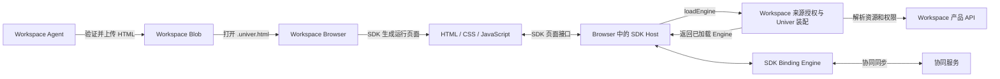

# Workspace HTML Views 集成设计

HTML Views 在 Workspace 中以 `.univer.html` Blob 保存，页面使用 HTML、CSS、JavaScript
展示和编辑已有 Sheet Unit 的数据。本文说明 Workspace 如何接入已发布的数据绑定 SDK。

## 集成边界

数据绑定 SDK 由 [univer-data-binding-sdk](https://github.com/dream-num/univer-data-binding-sdk)
维护。Workspace 从内部 npm 使用其公开 exports；registry 配置在[根 `.npmrc`](../../../.npmrc)，
版本以 consumer manifest 与 lockfile 为准。

| 依赖 | Workspace 中的用途 | Consumer |
| --- | --- | --- |
| `@univerjs-labs/html-view` | 识别文件、解析 HTML、提取声明式引用 | Browser、Agent 能力插件、CLI |
| `@univerjs-labs/html-view-renderer` | 生成运行页面、连接页面与宿主、提供保存和释放入口 | Browser |
| `@univerjs-labs/binding-engine` | 加载 Sheet Unit，提供数据读写、订阅和协同 | Browser |

Workspace 拥有 Blob 的产品入口、Space 与资源目录、用户身份、来源权限、Univer 配置、
页面生命周期和 Agent 发布流程。SDK 拥有 HTML 绑定属性、JavaScript 数据接口、页面运行时、
通信协议和 Engine 实现；这些合同以[上游文档](#sdk-文档)为准。

## 资源与权限

页面文件和来源 Sheet 是独立资源。HTML、CSS、JavaScript 保存在 Blob 中；单元格数据仍由
来源 Unit 的协同服务保存。修改页面中的绑定值会写入来源 Sheet，不会改写 HTML 文件。

HTML 角色控制文件本身：viewer 可以完整运行页面（包括表单提交和数据写入），editor 还可
修改模板，owner/admin 管理权限。所有可查看 HTML 的用户均可通过页面读写声明引用的完整
Sheet，无需另外获得来源权限。授权仅用于 `/universer-api/html-views/{resourceId}` 下的
Snapshot、协同和权限查询；直接打开来源 Resource 仍使用原有 ACL。本阶段不提供单元格或
范围隔离，页面界面本身不能限制用户可写的 Sheet 范围。

上传完成或替换模板时，服务端使用公开 HTML parser 读取声明。新引用要求本次发布者可编辑
对应 Sheet；保留的引用沿用上一版授权，即使本次编辑者没有直接来源权限。每版已完成的 Blob
Operation 保存 `htmlSourcePublishers`（Unit ID → 授权发布者），与模板切换在同一产品事务提交。
移除的引用不保留授权，重新添加时重新验证。运行时检查当前 HTML 查看权限及每个授权发布者
的来源编辑权限。客户端不能通过改 Unit ID 扩大授权，脚本使用的 Unit 必须在绑定属性中声明。
撤权、退出登录、来源不可访问或模板替换会关闭旧 HTML 协同连接（最长约一秒）；后续 HTTP
请求立即按当前权限检查。发布元数据复用现有 Operation，不新增数据库 schema 或持久化票据。

当前集成访问 Sheet 的 trunk；HTML Blob 不进入 Unit Worktree。Agent 发布页面本身不修改
来源 Sheet，页面中的数据写入仍通过现有协同服务完成。

## 集成流程

每次打开页面创建独立 Host。Host 按 Unit 管理 Engine；Workspace 在 `loadEngine` 中完成
授权和运行时装配，返回已加载的 Engine，由 Host 管理其后续生命周期。

多个页面与原生表格通过协同服务访问同一个 Unit，各自拥有独立运行时：

## 集成文档

- [Browser 集成](browser-integration.md)：构建、页面加载、来源授权、Univer 装配和保存释放。
- [Agent 集成](agent-integration.md)：页面生成指引、验证与发布、交付检查。

## SDK 文档

- [HTML 绑定属性与解析](https://github.com/dream-num/univer-data-binding-sdk/blob/main/packages/html-view/README.md)
- [JavaScript 页面接口](https://github.com/dream-num/univer-data-binding-sdk/blob/main/packages/html-view-renderer/docs/javascript-api.md)
- [Renderer 接入与生命周期](https://github.com/dream-num/univer-data-binding-sdk/blob/main/packages/html-view-renderer/README.md)
- [Engine 配置与工厂](https://github.com/dream-num/univer-data-binding-sdk/blob/main/packages/binding-engine/README.md)
- [单元格变化订阅方案与关键代码](https://github.com/dream-num/univer-data-binding-sdk/blob/main/packages/binding-engine/docs/change-subscription.md)

以上链接指向上游主分支；接入和升级时以实际安装版本的公开 exports、类型和随包文档为准。
