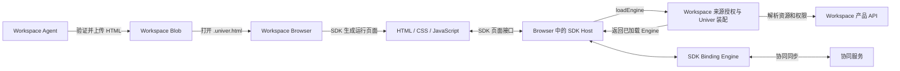
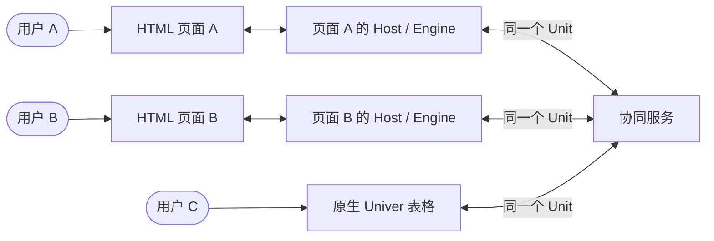

# Workspace HTML Views 集成设计

HTML Views 在 Workspace 中以 `.univer.html` Blob 保存，页面使用 HTML、CSS、JavaScript
展示和编辑已有 Sheet Unit 的数据。本文说明 Workspace 如何接入已发布的数据绑定 SDK。

## 集成边界

数据绑定 SDK 由 [univer-data-binding-sdk](https://github.com/dream-num/univer-data-binding-sdk)
维护。Workspace 从内部 npm 使用其公开 exports，当前三个包均锁定为 `1.0.0-rc.0`；
registry 配置在[根 `.npmrc`](../../../.npmrc)，版本由 consumer manifest 与 lockfile 管理。

| 依赖 | Workspace 中的用途 | Consumer |
| --- | --- | --- |
| `@univerjs-labs/html-view` | 识别文件、解析 HTML、提取声明式引用 | Browser、Agent 能力插件 |
| `@univerjs-labs/html-view-renderer` | 生成运行页面、连接页面与宿主、提供保存和释放入口 | Browser |
| `@univerjs-labs/binding-engine` | 加载 Sheet Unit，提供数据读写、订阅和协同 | Browser |

Workspace 拥有 Blob 的产品入口、Space 与资源目录、用户身份、来源权限、Univer 配置、
页面生命周期和 Agent 发布流程。SDK 拥有 HTML 绑定属性、JavaScript 数据接口、页面运行时、
通信协议和 Engine 实现；这些合同以[上游文档](#sdk-文档)为准。

## 资源与权限

页面文件和来源 Sheet 是独立资源。HTML、CSS、JavaScript 保存在 Blob 中；单元格数据仍由
来源 Unit 的协同服务保存。修改页面中的绑定值会写入来源 Sheet，不会改写 HTML 文件。

打开 HTML 文件的权限不授予来源 Sheet 权限。Browser 为当前登录用户逐个解析来源资源，
服务端校验实际读写权限。当前集成访问 Sheet 的 trunk；HTML Blob 不进入 Unit Worktree。
Agent 发布页面也不修改来源 Sheet。

## 集成流程

每次打开页面创建独立 Host。Host 按 Unit 管理 Engine；Workspace 在 `loadEngine` 中完成
授权和运行时装配，返回已加载的 Engine，由 Host 管理其后续生命周期。

多个页面与原生表格通过协同服务访问同一个 Unit，各自拥有独立运行时：

## 集成文档

- [Browser 集成](browser-integration.md)：构建、页面加载、来源授权、Univer 装配和保存释放。
- [Agent 集成](agent-integration.md)：页面生成指引、验证与发布、交付检查。

## SDK 文档

- [HTML 绑定属性与解析](https://github.com/dream-num/univer-data-binding-sdk/blob/main/packages/html-view/README.md)
- [JavaScript 页面接口](https://github.com/dream-num/univer-data-binding-sdk/blob/main/packages/html-view-renderer/docs/javascript-api.md)
- [Renderer 接入与生命周期](https://github.com/dream-num/univer-data-binding-sdk/blob/main/packages/html-view-renderer/README.md)
- [Engine 配置与工厂](https://github.com/dream-num/univer-data-binding-sdk/blob/main/packages/binding-engine/README.md)
- [单元格变化订阅方案与关键代码](https://github.com/dream-num/univer-data-binding-sdk/blob/main/packages/binding-engine/docs/change-subscription.md)

以上链接指向上游主分支；接入和升级时以实际安装版本的公开 exports、类型和随包文档为准。
