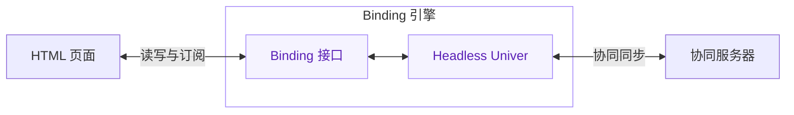
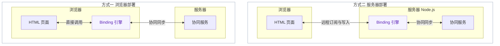

# Binding 引擎

[返回 Univer HTML Views 总览](README.md)

阶段：单 Engine 接口已实现；下方保留监听方案比较，真实多客户端协同仍待验证。

## 定位

Binding 引擎是基于 Univer SDK 的单元格数据绑定能力，提供 Unit 加载、单元格读取、
变化订阅、写入和资源管理。单向使用读取与订阅，双向使用额外调用写入接口。

## 核心实现与运行环境

Headless Univer 是引擎的内部实现，负责加载 Unit。引擎观察 mutation 和公式结果，
通过 Facade 读取单元格，写入使用同一公开命令并检查执行结果。默认工厂提供 Headless
Sheet、Pro 公式、网络和协同装配，不读取应用身份或许可证；特殊装配使用自定义工厂。



### 部署方式

以下是两种可选部署方式。每个 Binding 引擎都包含上述 Binding 接口与 Headless Univer。



左侧方案将页面和 Binding 引擎部署在浏览器中；右侧方案将 Binding 引擎与协同服务
部署在同一服务器中，页面通过网络接入绑定能力。分组表示部署位置，进程组织由实现决定。

## 对外接口

```ts
interface BindingEngineOptions {
  unitId: string;
  collaborationClientConfig: IUniverCollaborationClientConfig;
  createUniver?: (
    config: IUniverCollaborationClientConfig,
  ) => { univer: Univer; univerAPI: FUniver };
}

interface CellReference {
  sheetId: string;
  row: number;
  col: number;
}

type CellValue = NonNullable<ICellData["v"]>;
interface CellState {
  value: CellValue | null;
  available: boolean;
  writable: boolean;
}

class BindingEngine implements IDisposable {
  constructor(options: BindingEngineOptions);
  readonly unitId: string;
  load(): Promise<void>;
  getCellState(reference: CellReference): CellState;
  subscribeCell(reference: CellReference, listener: (state: CellState) => void): IDisposable;
  setCellValue(reference: CellReference, value: CellValue): void;
  getCollaborationStatus(): CollaborationStatus;
  subscribeCollaborationStatus(listener: (status: CollaborationStatus) => void): IDisposable;
  flush(): Promise<void>;
  dispose(): void;
}
```

每个 `BindingEngine` 对应一个 Unit，通过 Unit ID 和 SDK 的
`IUniverCollaborationClientConfig` 配置加载与协同连接。可选的 `createUniver` 工厂
用于定制 Headless Univer，返回值类型复用 SDK `createUniver` 的返回类型。

## 行为约定

- **引用**：`row`、`col` 是从 0 开始的非负整数，指向固定位置。结构变化后读取该坐标
  的当前内容；子表缺失或坐标越界时 `available` 和 `writable` 为 `false`，写入失败。
- **读取**：`getCellState()` 获取当前状态。值保留标量语义，公式格返回计算结果，空值为 `null`。
- **订阅**：`subscribeCell()` 立即通知当前状态，随后通知值、可用性或权限变化；状态相同则跳过。
  返回的 `IDisposable` 用于取消该订阅。
- **写入**：`setCellValue()` 保留标量类型并检查 SDK 权限，参数非法或不可写时抛错。
  通过 Facade 同步写入，直接传播 SDK 异常；返回值不额外承诺底层命令是否接受写入。
- **同步**：`getCollaborationStatus()` 和 `subscribeCollaborationStatus()` 提供 SDK 协同状态；
  `flush()` 等待当前修改同步确认，失败时拒绝 Promise。
- **加载**：`load()` 复用同一个 Promise，成功前不能操作数据；失败释放引擎，不自动重试。
- **释放**：`dispose()` 幂等，释放引擎持有的订阅和 Univer，随后停止通知并拒绝新操作。
  加载期间销毁后忽略迟到结果；`dispose()` 不隐式调用 `flush()`，正常结束编辑前由调用方显式保存。

## 使用示例

```ts
const engine = new BindingEngine({
  unitId,
  collaborationClientConfig: {
    socketService: BrowserCollaborationSocketService,
    snapshotServerUrl: "/universer-api/snapshot",
    collabSubmitChangesetUrl: "/universer-api/comb",
    collabWebSocketUrl: "wss://example.com/universer-api/comb/connect",
  },
});

try {
  await engine.load();
  const reference = { sheetId: "cash-model", row: 6, col: 1 };
  const subscription = engine.subscribeCell(reference, state => consume(state));
  engine.setCellValue(reference, 20);
  await engine.flush();
  subscription.dispose();
} finally {
  engine.dispose();
}
```

`socketService` 使用运行环境对应的 SDK 实现；示例中的
`BrowserCollaborationSocketService` 用于浏览器。

## 当前实现

`engine.ts` 是唯一生命周期所有者；`cell-access.ts` 集中 SDK 坐标读写；`create-univer.ts`
提供默认工厂。没有 Runtime、BindingUnit、CellBinding 三层对象，也不向消费者暴露内部 FUniver。

每个 Engine 只有一张按坐标组织的订阅表，同一坐标只读取一次再分发。直接读取以 SDK 为准，
每个订阅只保留最后通知状态用于去重（新订阅不会重复收到其初始值）；
取消最后一个订阅便删除该坐标。mutation、公式结果和权限事件合并为一个微任务，重读订阅坐标。
当前采用下面方案二的保守版本：按 Unit 失效，不逐一复制 mutation 的范围推导或维护结构命令清单。

写入使用 Facade `setValue({ v, t, p: null, f: null, si: null })`，显式保留标量类型、清除原公式和富文本。后续刷新
统一由 SDK 事件触发。SDK 的布尔值恢复为逻辑值；非法值、不可写操作直接抛错，不自动重试。
加载失败直接释放实例；加载期间销毁不实现取消 Promise 竞速，也不承诺立即中止 SDK 请求。
订阅者异常在统一通知入口报告，不阻断其他订阅者。

Workspace 负责来源权限、身份、许可证和引用策略，创建并加载 Engine 后交给 Renderer。
Renderer 只管理 DOM 和输入节流；宿主显示 SDK 同步状态，并在正常离开页面前显式 flush。

## 变化监听的候选方案

两种方案保持相同的 Binding 接口，区别在于值变化的监听入口。以下片段针对已加载的
有效单元格，省略通用状态管理；方案尚待验证与选择。

```ts
// 以下为引擎内部监听方案，api 是内部 Headless Univer 的 Facade。
const api = univerAPI;
const { unitId } = options;
const { sheetId, row, col } = ref;
const cell = () => api.getWorkbook(unitId)!
  .getSheetBySheetId(sheetId)!.getRange(row, col);
```

### 方案一：Facade 事件

使用 `SheetValueChanged` 提供的受影响范围，判断是否包含目标单元格。

```ts
const values = api.addEvent(api.Event.SheetValueChanged, event => {
  const affected = event.effectedRanges.some(range => {
    const area = range.getRange();
    return range.getUnitId() === unitId && range.getSheetId() === sheetId
      && row >= area.startRow && row <= area.endRow
      && col >= area.startColumn && col <= area.endColumn;
  });
  if (affected) onChange(cell().getRawValue());
});
```

优点是接口简洁，复用 SDK 的范围推导。当前源码中的事件由固定 mutation 列表生成，
且带有 `getActiveSheet()` 前置检查；headless 场景和行列、子表结构变化需要补齐覆盖。

### 方案二：直接监听 mutation

通过 `ICommandService.onCommandExecuted` 识别 mutation，按其参数定位受影响单元格。
以下以直接写值为例，`univer` 是引擎持有的 SDK 实例。

```ts
import { ICommandService } from "@univerjs/core";
import { SetRangeValuesMutation, type ISetRangeValuesMutationParams } from "@univerjs/sheets";

const commands = univer.__getInjector().get(ICommandService);
const values = commands.onCommandExecuted(command => {
  if (command.id !== SetRangeValuesMutation.id) return;
  const params = command.params as ISetRangeValuesMutationParams;
  if (params.unitId !== unitId || params.subUnitId !== sheetId) return;

  // 空 cellValue 表示清空；稀疏矩阵只检查目标坐标是否包含在本次写入中。
  if (params.cellValue == null || Object.hasOwn(params.cellValue[row] ?? {}, col)) {
    onChange(cell().getRawValue());
  }
});
```

这一方式直接对应 Univer 内部的监听机制，按目标 Unit 工作。完整实现需要为移动、
排序、行列增删和子表增删增加对应处理，按固定坐标语义重新读取值或更新可用状态。
范围推导可复用 SDK 现有工具，覆盖清单由 Binding 明确维护。

### 两种方案共用：公式结果与写值

```ts
const formulas = api.getFormula().calculationResultApplied(result => {
  const cells = result.unitData[unitId]?.[sheetId];
  if (Object.hasOwn(cells?.[row] ?? {}, col)) {
    onChange(cell().getRawValue());
  }
});

cell().setValue(20);

values.dispose();
formulas.dispose();
```

公式结果应用后再读取，可写状态另外接入 SDK 权限通知。数据通知表示目标受影响，
Binding 仍需比较实际状态，再向订阅者发出变化。

### 取舍

| 维度 | Facade 事件 | 直接 mutation |
| --- | --- | --- |
| 接入 | 简洁，SDK 已提供受影响范围 | 需要按 mutation 解析影响 |
| Headless | 需验证并处理活动表前置条件 | 直接定位目标 Unit |
| 覆盖 | 依赖事件的 mutation 列表，结构变化需补充 | Binding 显式维护值与结构变化的覆盖 |
| 演进 | 跟随 Facade 事件合同 | 跟随 mutation 合同及范围工具 |

当前实现使用上文所述的 Unit 级 mutation 失效；这里的精确范围方案和 Facade 方案作为
后续优化候选保留。更换失效策略需要验证
直接写值、远端更新、撤销重做、结构变化和公式结果的完整通知。

## 验证边界

本地测试使用真实 SDK 数据模型与命令，覆盖标量、公式、结构变化、权限、订阅去重、
加载失败与销毁；同步状态及 flush 的传播使用 SDK 边界替身。这不等同于真实网络验证。
以下仍需验证：

- headless 加载、协同和公式计算的完整性。
- 变化通知、写值类型与失败语义的正确性。
- 加载期间销毁与订阅释放，以及加载和计算成本。
- 协同状态通知与 `flush()` 的确认和失败语义。
- 多个协同客户端之间的数据联动。
