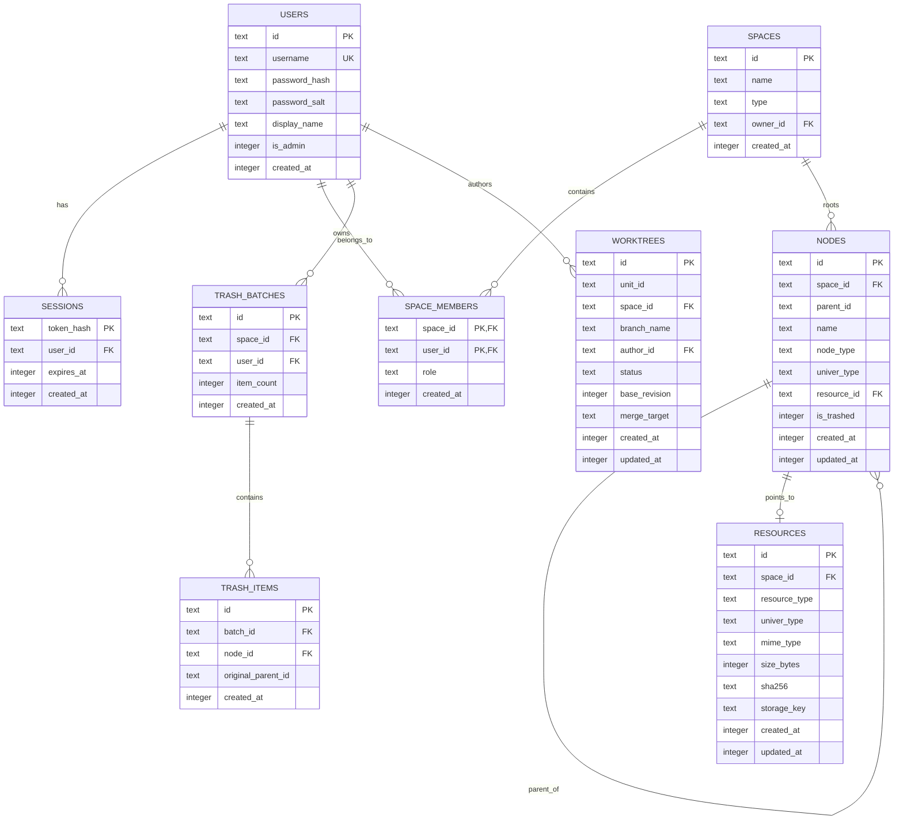

# Control Plane & Blob Storage Specification

This specification documents the **Cloudflare D1 Control Plane Database** and **Cloudflare R2 Blob Storage** models for Univer Workspace.

---

## 1. Cloudflare D1 Control Plane Schema

The control plane stores global relational state for user accounts, authentication sessions, space hierarchies, document references, trash lifecycle, and worktree branches.



### Complete DDL Migrations

```sql
-- 1. Users
CREATE TABLE IF NOT EXISTS users (
  id TEXT PRIMARY KEY,
  username TEXT UNIQUE NOT NULL,
  password_hash TEXT NOT NULL,
  password_salt TEXT NOT NULL,
  display_name TEXT NOT NULL,
  is_admin INTEGER DEFAULT 0,
  created_at INTEGER NOT NULL
);

-- 2. Login Sessions
CREATE TABLE IF NOT EXISTS sessions (
  token_hash TEXT PRIMARY KEY,
  user_id TEXT NOT NULL REFERENCES users(id) ON DELETE CASCADE,
  expires_at INTEGER NOT NULL,
  created_at INTEGER NOT NULL
);
CREATE INDEX IF NOT EXISTS idx_sessions_user_id ON sessions(user_id);

-- 3. Spaces
CREATE TABLE IF NOT EXISTS spaces (
  id TEXT PRIMARY KEY,
  name TEXT NOT NULL,
  type TEXT CHECK(type IN ('personal', 'team')) NOT NULL,
  owner_id TEXT NOT NULL REFERENCES users(id),
  created_at INTEGER NOT NULL
);

-- 4. Space Members
CREATE TABLE IF NOT EXISTS space_members (
  space_id TEXT NOT NULL REFERENCES spaces(id) ON DELETE CASCADE,
  user_id TEXT NOT NULL REFERENCES users(id) ON DELETE CASCADE,
  role TEXT CHECK(role IN ('owner', 'editor', 'viewer')) NOT NULL,
  created_at INTEGER NOT NULL,
  PRIMARY KEY (space_id, user_id)
);

-- 5. Tree Nodes
CREATE TABLE IF NOT EXISTS nodes (
  id TEXT PRIMARY KEY,
  space_id TEXT NOT NULL REFERENCES spaces(id) ON DELETE CASCADE,
  parent_id TEXT,
  name TEXT NOT NULL,
  node_type TEXT CHECK(node_type IN ('folder', 'univer', 'blob')) NOT NULL,
  univer_type TEXT,
  resource_id TEXT,
  is_trashed INTEGER DEFAULT 0,
  created_at INTEGER NOT NULL,
  updated_at INTEGER NOT NULL
);
CREATE INDEX IF NOT EXISTS idx_nodes_space_parent ON nodes(space_id, parent_id);
CREATE INDEX IF NOT EXISTS idx_nodes_trashed ON nodes(is_trashed);

-- 6. Resources
CREATE TABLE IF NOT EXISTS resources (
  id TEXT PRIMARY KEY,
  space_id TEXT NOT NULL REFERENCES spaces(id) ON DELETE CASCADE,
  resource_type TEXT CHECK(resource_type IN ('univer', 'blob')) NOT NULL,
  univer_type TEXT,
  mime_type TEXT,
  size_bytes INTEGER DEFAULT 0,
  sha256 TEXT,
  storage_key TEXT,
  created_at INTEGER NOT NULL,
  updated_at INTEGER NOT NULL
);

-- 7. Trash Batches & Items
CREATE TABLE IF NOT EXISTS trash_batches (
  id TEXT PRIMARY KEY,
  space_id TEXT NOT NULL REFERENCES spaces(id) ON DELETE CASCADE,
  user_id TEXT NOT NULL REFERENCES users(id),
  item_count INTEGER NOT NULL,
  created_at INTEGER NOT NULL
);

CREATE TABLE IF NOT EXISTS trash_items (
  id TEXT PRIMARY KEY,
  batch_id TEXT NOT NULL REFERENCES trash_batches(id) ON DELETE CASCADE,
  node_id TEXT NOT NULL REFERENCES nodes(id) ON DELETE CASCADE,
  original_parent_id TEXT,
  created_at INTEGER NOT NULL
);

-- 8. Worktrees
CREATE TABLE IF NOT EXISTS worktrees (
  id TEXT PRIMARY KEY,
  unit_id TEXT NOT NULL,
  space_id TEXT NOT NULL REFERENCES spaces(id) ON DELETE CASCADE,
  branch_name TEXT NOT NULL,
  author_id TEXT NOT NULL REFERENCES users(id),
  status TEXT CHECK(status IN ('draft', 'ready', 'merged', 'discarded')) DEFAULT 'draft',
  base_revision INTEGER NOT NULL,
  merge_target TEXT DEFAULT 'trunk',
  created_at INTEGER NOT NULL,
  updated_at INTEGER NOT NULL
);
```

---

## 2. WebCrypto Security & Auth Engine

All cryptographic routines are implemented directly using the standardized browser and edge W3C `crypto.subtle` API.

### PBKDF2 Password Hashing
- **Algorithm**: PBKDF2
- **Hash Function**: SHA-256
- **Iterations**: 100,000
- **Salt**: 32 cryptographically random bytes generated via `crypto.getRandomValues(new Uint8Array(32))`
- **Storage**: Hex-encoded salt and hash stored in `users.password_salt` and `users.password_hash`.

### Session Tokens
- **Generation**: 32 cryptographically random bytes converted to hex (64 hex characters, 256 bits of entropy).
- **Storage Hash**: SHA-256 digest of the token is computed and stored as the primary key in `sessions.token_hash`. The plain token is never stored in the database.
- **Cookie Contract**:
  ```http
  Set-Cookie: workspace_session=<plain_token>; Path=/; Max-Age=2592000; HttpOnly; SameSite=Lax; Secure
  ```

---

## 3. Cloudflare R2 Blob Storage

Binary files (images, attachments, exported workbooks, and PDF renders) are stored in Cloudflare R2 via `env.BLOB_BUCKET`.

### Object Key Schema
- Blob binaries: `blobs/{resourceId}`
- Upload session chunks: `uploads/{sessionId}/chunk_{partIndex}`

### Content-Type Detection
The system inspects magic byte headers in memory before writing to R2:
- PNG: `89 50 4E 47 0D 0A 1A 0A` -> `image/png`
- JPEG: `FF D8 FF` -> `image/jpeg`
- WEBP: `52 49 46 46 ... 57 45 42 50` -> `image/webp`
- PDF: `%PDF-` -> `application/pdf`
- ZIP / Office: `50 4B 03 04` -> `application/zip`

### HTTP Range Request Slicing
To support video previews, large images, and resumeable file downloads, the R2 gateway implements RFC 7233 byte-range serving:

1. Client sends `Range: bytes=1024-2047`.
2. Gateway calculates offset and length, passing `{ range: { offset: 1024, length: 1024 } }` to `env.BLOB_BUCKET.get()`.
3. Gateway responds with `HTTP 206 Partial Content`:
   ```http
   HTTP/1.1 206 Partial Content
   Content-Range: bytes 1024-2047/10485760
   Content-Length: 1024
   Content-Type: image/png
   Accept-Ranges: bytes
   ```
