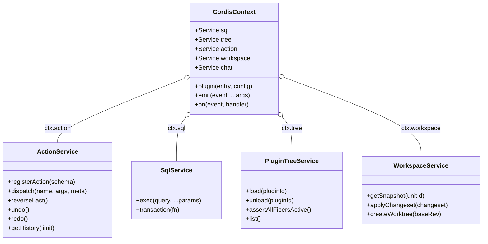
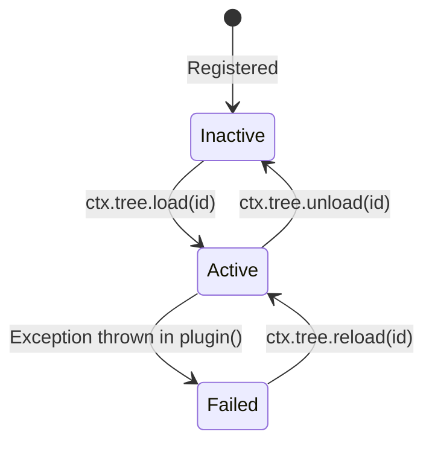

# Cordis Microkernel on Cloudflare Durable Objects Specification

This specification documents the runtime architecture, lifecycle, and service contracts of the **Cordis v4 Microkernel** executing inside Cloudflare Durable Objects for **Univer Workspace**.

---

## 1. Microkernel Architecture in V8 Isolates

Cordis is an inversion-of-control (IoC) and service microkernel designed for JavaScript environments. In Univer Workspace, Cordis runs directly inside Cloudflare Durable Objects, managing lifecycle, dependency injection, and plugin orchestration in memory without Node.js system dependencies.



---

## 2. Dynamic Plugin Tree & Fiber Lifecycle

All plugins enabled on a document are persisted in the Durable Object's embedded SQLite database. Upon isolate wakeup (after sleep/eviction), the microkernel reads the plugin tree and reconstitutes the in-memory fibers.

### SQLite Schema: `plugin_tree`

```sql
CREATE TABLE IF NOT EXISTS plugin_tree (
  id TEXT PRIMARY KEY,
  name TEXT NOT NULL,
  version TEXT NOT NULL,
  config TEXT DEFAULT '{}',
  status TEXT CHECK(status IN ('ACTIVE', 'INACTIVE', 'FAILED')) DEFAULT 'ACTIVE',
  error TEXT,
  updated_at INTEGER NOT NULL
);
```

### State Transitions



### Invariant: `assertAllFibersActive()`

To prevent "ghost" plugins or dangling event listeners, every boot or plugin reload must pass the `assertAllFibersActive()` assertion:

```typescript
export function assertAllFibersActive(ctx: Context, expectedPlugins: string[]): void {
  const inactiveFibers = expectedPlugins.filter((pluginId) => {
    // Verify each plugin has an active fiber scope in Cordis Context
    const scope = ctx.registry.get(pluginId);
    return !scope || !scope.isActive;
  });

  if (inactiveFibers.length > 0) {
    throw new Error(
      `Kernel integrity failure: Inactive fibers detected: [${inactiveFibers.join(', ')}]`
    );
  }
}
```

---

## 3. Universal Action Engine (`src/kernel/action.ts`)

The Universal Action Engine unifies user actions triggered via the frontend UI/RPC and automated tool actions invoked by AI agents into a single reversible execution pipeline.

### Core Capabilities
1. **Typed Action Registration**: Services register actions declaring arguments, execution handlers, and reversible inverse handlers.
2. **SQLite Action Journaling**: Every action dispatch writes an immutable row to `action_journal`.
3. **Reversible Inverses (Undo/Redo)**: Every mutation defines its inverse. Calling `reverseLast()` or `undo()` executes the inverse mutation and updates the journal.
4. **Dual Exposition**: Registered actions are automatically accessible via:
   - Host RPC Channel 0 (`action.dispatch`)
   - LLM Tool Calling (function calling schema exported to OpenAI/Anthropic format)

### SQLite Schema: `action_journal`

```sql
CREATE TABLE IF NOT EXISTS action_journal (
  id TEXT PRIMARY KEY,
  action_name TEXT NOT NULL,
  payload TEXT NOT NULL,
  inverse_payload TEXT,
  author_id TEXT NOT NULL,
  is_undone INTEGER DEFAULT 0,
  created_at INTEGER NOT NULL
);
```

### Action Definition Contract

```typescript
export interface ActionDefinition<TArgs = any, TResult = any, TInverse = any> {
  name: string;
  description: string;
  parameters: Record<string, any>; // JSON Schema
  execute: (ctx: Context, args: TArgs, meta: ActionMeta) => Promise<TResult> | TResult;
  invert?: (ctx: Context, args: TArgs, result: TResult, meta: ActionMeta) => TInverse;
  executeInverse?: (ctx: Context, inverseArgs: TInverse, meta: ActionMeta) => Promise<void> | void;
}
```

### Built-in Univer Actions

| Action Name | Description | Reversible? |
| :--- | :--- | :--- |
| `univer.sheet.setCell` | Updates a specific cell value/format in a worksheet. | Yes (`setCell` with previous value) |
| `univer.sheet.insertRow` | Inserts rows at the specified index. | Yes (`deleteRow`) |
| `univer.sheet.insertColumn` | Inserts columns at the specified index. | Yes (`deleteColumn`) |
| `univer.worktree.createDraft` | Creates an isolated branched draft from a base revision. | Yes (`deleteDraft`) |
| `univer.worktree.mergeDraft` | Merges an approved draft back into the document trunk. | Yes (records inverse delta) |

---

## 4. Built-in Plugin Catalog (`src/kernel/catalog.ts`)

| Plugin Name | Service Key | Description |
| :--- | :--- | :--- |
| `univer-collab` | `workspace` | Manages Univer OT collaboration, snapshot persistence, and revision tracking. |
| `univer-tools` | `tools` | Exposes spreadsheet manipulation tools to LLM agents and scripts. |
| `dsh-action-engine` | `action` | Dispatches actions, enforces undo/redo invariants, and writes journals. |
| `dsh-workspace` | `workspace` | Worktree lifecycle, branch management, and snapshot forks. |
| `dsh-chat` | `chat` | Manages LLM agent turns, streaming chunks, and tool calling loops. |
