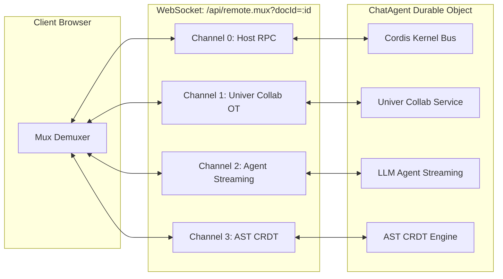
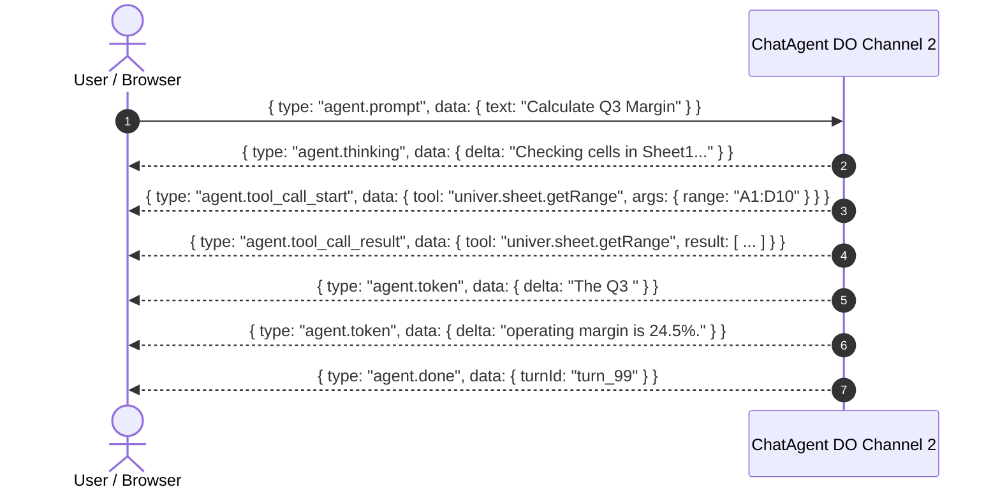

# Realtime Protocols & Multiplexer Specification

This specification documents the network protocols and WebSocket channels connecting the **Univer Workspace Client** with the **Cloudflare Edge Backend**.

---

## 1. 4-Channel Remote Multiplexer (`/api/remote.mux`)

Document collaboration, AI agent streaming, and Host RPC execute over a single multiplexed WebSocket connection routed directly to the document's `ChatAgent` Durable Object.



### Frame Envelope Specification

All frames exchanged on `/api/remote.mux` are serialized as JSON payloads adhering to this envelope:

```typescript
interface MuxFrame<T = any> {
  ch: 0 | 1 | 2 | 3;           // Target multiplex channel
  id?: string;                 // Correlation ID (for RPC request/response)
  type: string;                // Frame event or method name
  data?: T;                    // Channel-specific payload
  error?: {
    code: string;
    message: string;
  };
}
```

---

### Channel 0: Host RPC Protocol

Used for administrative and runtime control of the Cordis microkernel.

#### Request / Response Semantics
- Clients generate a unique UUID `id` for each request.
- The server responds with the matching `id`.

#### Supported Methods

##### `plugin.list`
- **Request**: `{ ch: 0, id: "req-1", type: "plugin.list" }`
- **Response Data**:
  ```json
  [
    { "id": "univer-collab", "name": "Univer Collab", "status": "ACTIVE" },
    { "id": "dsh-action-engine", "name": "Action Engine", "status": "ACTIVE" }
  ]
  ```

##### `action.dispatch`
- **Request**:
  ```json
  {
    "ch": 0,
    "id": "req-2",
    "type": "action.dispatch",
    "data": {
      "name": "univer.sheet.setCell",
      "args": { "sheetId": "sheet-1", "row": 0, "col": 0, "value": "Revenue" }
    }
  }
  ```
- **Response Data**:
  ```json
  {
    "journalId": "act_89f41b",
    "success": true,
    "result": { "previousValue": "" }
  }
  ```

##### `action.undo`
- **Request**: `{ ch: 0, id: "req-3", type: "action.undo" }`
- **Response Data**: `{ "undoneActionId": "act_89f41b", "success": true }`

---

### Channel 1: Univer Collab OT Protocol

Synchronizes spreadsheet changesets and revisions using Operational Transformation (OT).

#### Frame Types

##### Client -> Server: `collab.submit_changeset`
```json
{
  "ch": 1,
  "type": "collab.submit_changeset",
  "data": {
    "unitId": "doc_welcome",
    "baseRev": 4,
    "changeset": [ ... ]
  }
}
```

##### Server -> Client: `collab.changeset_ack`
```json
{
  "ch": 1,
  "type": "collab.changeset_ack",
  "data": {
    "unitId": "doc_welcome",
    "newRev": 5,
    "changeset": [ ... ],
    "authorId": "user_admin"
  }
}
```

##### Server -> Client: `collab.snapshot_sync`
Broadcasts the full authoritative workbook state when a client joins or after reconnect.

---

### Channel 2: AI Agent Streaming Protocol

Streams LLM tokens, reasoning chunks, and tool invocation lifecycles from the ChatAgent isolate to the UI.

#### Event Sequence



---

### Channel 3: AST CRDT Protocol

Synchronizes structured document node hierarchies (Doc and Slide block trees) using conflict-free replicated data types.

---

## 2. Space Presence & Tree Sync Protocol (`/spaces/:spaceId/live`)

Connected via `WorkspaceDO`, this WebSocket endpoint synchronizes workspace file/folder hierarchies and user presence across all collaborators in a space.

### Frame Format

```typescript
interface SpaceLiveEvent<T = any> {
  event: 'presence.update' | 'tree.node.created' | 'tree.node.updated' | 'tree.node.deleted';
  spaceId: string;
  data: T;
  timestamp: number;
}
```

### Event Payloads

#### `presence.update`
```json
{
  "event": "presence.update",
  "spaceId": "space_personal_admin",
  "timestamp": 1789087200000,
  "data": {
    "userId": "user_admin",
    "displayName": "Administrator",
    "activeNodeId": "node_sheet_1",
    "cursor": { "x": 340, "y": 180 }
  }
}
```

#### `tree.node.created`
```json
{
  "event": "tree.node.created",
  "spaceId": "space_personal_admin",
  "timestamp": 1789087200100,
  "data": {
    "id": "node_sheet_2",
    "parentId": "space_personal_admin",
    "name": "Q4 Budget",
    "nodeType": "univer",
    "univerType": "sheet",
    "createdAt": 1789087200100
  }
}
```
