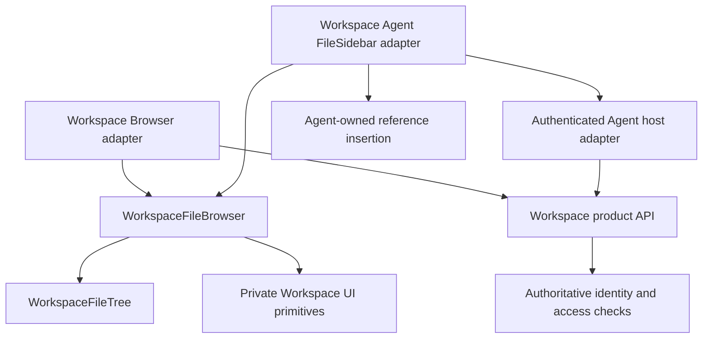

# @univerjs/univer-workspace-file-browser

Private file-navigation components shared by Workspace Browser and Workspace
Agent. This is the tree shown in their file sidebars, including Personal/Team
Spaces, lazy folder expansion, selection, resource icons, drag-and-drop movement,
creation/upload menus, node actions, sharing/rename/trash dialogs, and feedback.
It is not the Worktree review tree or the Agent conversation list.

## Ownership and consumers

| Responsibility | Owner |
| --- | --- |
| Tree rows, expansion, shared menus/dialogs, keyboard and visual behavior | This package |
| HTTP requests, credentials, capability mapping and account changes | Each application's adapter |
| Selected routes, document viewers, conversation state and reference insertion | Each application |
| Authoritative permissions and mutation validation | Workspace server |

Workspace Browser composes the package in
`apps/workspace/web/src/features/nodes/workspace-navigation-tree.tsx`.
Agent composes it in
`packages/dsh-univer-workspace-plugin/src/client/FileSidebar.tsx`.
The adapters have independent data sources and navigation callbacks. Changes to
shared defaults or styles affect both applications; application-only behavior
belongs in the adapter or an explicit extension point.

## Customization

`WorkspaceFileBrowser` provides standard file-management behavior. Supply
`spaces`, `dataSource`, `storageScope`, `locale`, controlled selection, and
`onOpenSpace`/`onOpenNode` callbacks. Use `renderNodeActions(node, controls)` to
append application-specific row actions without replacing the standard menus.

For example, Agent supplies an add-to-conversation action for documents and
folders. Its adapter uses `node.resource === null` to identify folders, creates
the appropriate reference, and restores the selected conversation. Workspace
Browser does not supply this action and does not acquire conversation behavior.
Folder creation keeps a plain plus icon; adding a reference uses a conversation
plus icon and a descriptive accessible label.

For a substantially different row composition, use `WorkspaceFileTree` with
`renderSpaceActions`, `renderTeamActions`, and `decorateNodeRow`. The decorator
receives the standard row renderer and controls; retain its selection, expansion,
and keyboard behavior. If a product needs different business semantics, keep its
wrapper or business component separate instead of adding checks for application
names, DSH sessions, or routes inside this package.

## Safety and maintenance boundaries

- Capability flags control presentation; they are not authorization. The server
  must validate the current identity, target and permission for every operation.
  A consumer-provided Node ID or a visible action cannot grant access.
- `dataSource` owns authenticated calls and failure handling. This package must
  not read credentials, select an account, import DSH, or call a product endpoint
  directly. Isolate `storageScope` by service/account so expansion preferences do
  not leak between identities; discard stale account data in the adapter.
- Row actions must stop click propagation when they should not also select/open
  the row. Give icon-only controls accessible labels. Referencing a folder does
  not create, move, upload, or recursively read its contents; the Agent validates
  references again when sending.
- Extend behavior with optional callbacks and preserve the default when omitted.
  Avoid global CSS or selectors that reach into the other application's layout.
  A shared behavior/style change requires verification in both consumers;
  an adapter-only extension should leave the other consumer unchanged.
- Shared UI uses the host's React runtime. Workspace uses React 19 and published
  DSH uses React 18; follow the root `AGENTS.md` React/Redi guidance rather than
  adding a bundled React runtime or forcing a single version.
- Import the package root only. Do not depend on `src`/`dist` internals or introduce
  dependencies on an application's private paths.

For shared changes, run this package's tests and typecheck plus the affected
Workspace and Agent checks. Verify lazy expansion, selection, action clicks,
keyboard access, permission-denied handling, and account switching as relevant.
For adapter-only actions, verify that the callback preserves the current session
and draft and that Workspace's existing tree interaction remains unchanged.
