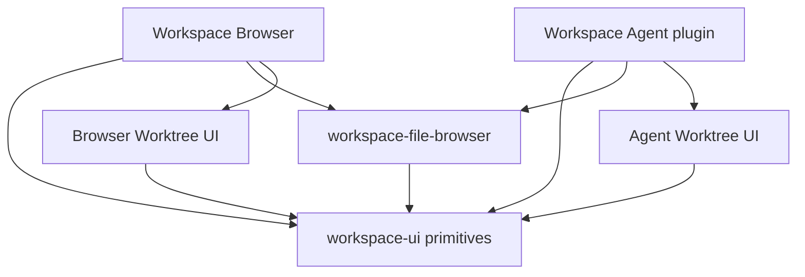

# Univer Workspace UI

English | [简体中文](README.zh-CN.md)

Private UI primitives shared by Workspace Browser and Workspace Agent. This
package owns reusable control behavior and presentation: buttons, inputs,
selection controls, menus, dialogs, tooltips, badges, avatars, icons, and toast
presentation. It is internal to this repository and is not a public Univer SDK.

Import components through `@univerjs/univer-workspace-ui`. The public exports for
repository consumers are listed in [src/index.ts](src/index.ts).

## Where this package fits



Sharing controls does not require sharing a product's screens or workflows.
Workspace Browser and Agent keep their Worktree lists, list items, and review
interaction separate. Their layouts and user actions can evolve independently
while using the same buttons, menus, icons, and compatible types.

The shared file-navigation tree belongs to
[workspace-file-browser](../workspace-file-browser/README.md), not this package.
That package owns its reusable tree and file-management interactions; each
application supplies its data source, navigation, and optional row actions.

## Decide where a change belongs

| Proposed change | Owner and reason |
| --- | --- |
| Button focus ring, disabled interaction, menu keyboard behavior, dialog layout, or a reusable icon | `workspace-ui`: the behavior can be specified without a Space, Unit, Session, or account |
| Directory expansion, shared file row layout, or file-management dialogs | `workspace-file-browser`: these require the shared file-navigation model |
| Agent-only “Add to message” action on a document or folder | Agent's file-browser adapter: use the tree's `renderNodeActions` extension; conversation state belongs to Agent |
| Worktree list, item layout, merge flow, or selected review state | The consuming application: Browser and Agent have separate business UI |
| HTTP calls, credentials, account switching, cache invalidation, or route state | Application/service adapters; UI primitives receive values and callbacks |
| Authoritative permissions, deletion rules, or merge validation | Workspace server and the relevant domain service; a visible or disabled button is not authorization |
| Product enums, identity types, or wire payloads | Their existing domain/contract owner; consume shared types without moving them into a UI package |

A good extraction has a useful, testable contract without knowing which
application renders it. A `ConfirmDialog` can own focus and confirmation controls;
it does not decide whether deleting a Unit is allowed, call the delete endpoint,
or recover a failed operation. Likewise, a badge can display a label and visual
variant without defining the Worktree status machine.

Start an application-specific composition in its owning application. Extract it
when consumers need the same interaction contract. Similar markup alone is not a
reason to share business UI. If a proposal needs an application-name switch,
Session IDs, API access, or routing imports here, keep it in the application or
review the responsibility split first.

## Consumer responsibilities

The package owns the visual, focus, keyboard, portal, and accessibility behavior
of the controls it provides. The consumer still owns the complete interaction:

- Supply values, localized labels, accessible names for icon-only actions, and
  callbacks. Choose the meaning of an action and its enabled state.
- Handle asynchronous work, pending state, errors, retries, and refresh after a
  mutation. `ConfirmDialog.onConfirm` is a callback; the component does not await
  a remote operation or decide when the product operation has succeeded.
- Resolve permissions through the application and enforce them on the server.
  `disabled`, a hidden menu item, and a confirmation dialog are presentation.
- Own selected routes, document identities, account-scoped caches, and lifecycle
  cleanup. No component here should read credentials or select a Workspace.
- Supply the host theme tokens and mount toast presentation where the application
  needs it. These primitives consume `--color-*` CSS variables; portal content
  must inherit the intended theme outside the triggering component's subtree.

For example, an Agent adapter can compose a generic control with its own action:

```tsx
import { Button, MessageSquarePlusIcon } from '@univerjs/univer-workspace-ui';

<Button
  variant="ghost"
  size="icon-sm"
  aria-label={t('resource.addToMessage')}
  disabled={!canReference}
  onClick={(event) => {
    event.stopPropagation();
    addToCurrentMessage();
  }}
>
  <MessageSquarePlusIcon />
</Button>
```

Here `t`, `canReference`, and `addToCurrentMessage` are supplied by the application.
The button does not know about a Session or a Resource. In a file tree, use the
file-browser extension point rather than adding this behavior to its shared
row defaults. See the [file-browser customization guide](../workspace-file-browser/README.md#customization).

## Styling and compatibility

Use component props and application-owned wrappers for local customization.
Keep reusable styles in this package's CSS modules; avoid selectors that reach
into DSH, a Workspace screen, or another package's generated class names.
Changing a shared default affects both consumers, including keyboard interaction,
focus restoration, portal layering, and narrow layouts. Preserve existing
behavior when an optional prop is omitted.

The package exports TypeScript source and SCSS. The consuming build processes
those files and supplies React through peer dependencies; this package does not
ship an independent React runtime. Workspace Browser uses React 19, while the
published DSH browser used by Agent uses React 18. The React 18 development
dependencies here support package development; they do not select the runtime
for Workspace Browser. Each application's build must resolve one matching React
and React DOM pair. Do not force one React version across both applications or
bundle a second runtime to make a shared component compile.

The repository also has version-scoped Redi `packageExtensions` that repair
published SDK declaration metadata in these separate dependency graphs. They are
not dev SDK version overrides and are not a reason to add DI or direct Redi
imports to UI primitives. Univer consumers obtain DI APIs and types through
`@univerjs/core`. Follow the [React and Redi guidance](../../AGENTS.md#react-and-redi-dependency-boundaries)
when changing dependency versions or removing an extension; a successful build
with an existing `node_modules` tree is insufficient evidence.

## Verification when changing shared controls

Run this package's typecheck and the affected application checks from the
repository root:

```bash
pnpm --filter @univerjs/univer-workspace-ui typecheck
pnpm --filter @univerjs/univer-workspace typecheck
pnpm --filter dsh-univer-workspace-plugin typecheck
```

This package currently has no standalone test script. Use the relevant consumer
tests and browser checks to verify the changed behavior. For a shared control,
exercise both Workspace Browser and Agent: pointer and keyboard actions,
disabled/pending states, focus after closing menus or dialogs, portal stacking,
light/dark themes, and narrow layouts as applicable. Verify that a row action does
not also open its row and that localized labels remain usable.

For dependency or bundling changes, also build and start both applications after
an isolated clean install. For application-only behavior, verify the owning
adapter and preserve the other application's existing interaction. Do not widen
the shared contract solely to make the two screens look alike.
