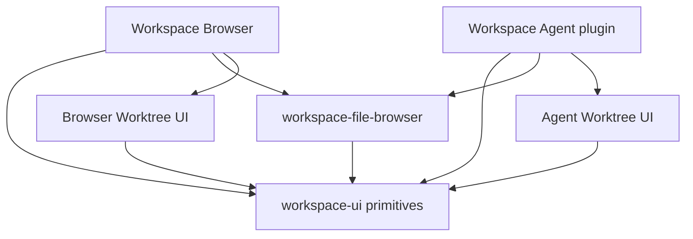

# Univer Workspace UI

[English](README.md) | 简体中文

供 Workspace Browser 和 Workspace Agent 共享的私有 UI 基础组件。
本包负责可复用控件的行为与展示，包括按钮、输入框、选择控件、菜单、对话框、提示、徽标、头像、图标和 Toast 展示。
它是仓库内部实现，不是公共 Univer SDK。

通过 `@univerjs/univer-workspace-ui` 导入组件。
仓库内消费者可使用的公开导出见 [src/index.ts](src/index.ts)。

## 本包在架构中的位置



共享控件不意味着必须共享产品页面或工作流。
Workspace Browser 与 Agent 分别维护各自的 Worktree 列表、列表项及审查交互。
两边的布局和用户操作可以独立演进，同时继续使用相同的按钮、菜单、图标和兼容类型。

共享文件导航树归 [workspace-file-browser](../workspace-file-browser/README.md) 所有。
该包负责可复用的树及文件管理交互，每个应用提供自己的数据源、导航和可选行操作。

## 如何判断改动的归属

| 计划修改的内容 | 归属及原因 |
| --- | --- |
| 按钮焦点环、禁用交互、菜单键盘行为、对话框布局或可复用图标 | `workspace-ui`：无需知道 Space、Unit、Session 或账号就能定义行为 |
| 目录展开、共享文件行布局或文件管理对话框 | `workspace-file-browser`：需要共享文件导航模型 |
| 仅 Agent 使用的文档/文件夹“加入消息”操作 | Agent 的文件浏览器适配器：使用树的 `renderNodeActions` 扩展点，对话状态归 Agent 所有 |
| Worktree 列表、列表项布局、合入流程或所选审查状态 | 消费它的应用：Browser 与 Agent 维护独立业务 UI |
| HTTP 请求、凭据、切换账号、缓存失效或路由状态 | 应用/服务适配器；基础 UI 只接收值与回调 |
| 权限权威判断、删除规则或合入校验 | Workspace 服务端及相应领域服务；按钮可见或禁用不是授权 |
| 产品枚举、身份类型或网络载荷 | 现有领域/合同的所有者；可以消费共享类型，不应把它们搬进 UI 包 |

合适的抽取应有明确且可测试的合同，无需知道自己由哪个应用渲染。
`ConfirmDialog` 可以负责焦点和确认控件，但不判断是否允许删除 Unit，不调用删除接口，也不恢复失败的操作。
同样，徽标可以显示标签和视觉样式，而不定义 Worktree 状态机。

应用特有的组合先放在所属应用中。当多个消费者确实需要相同交互合同时再抽取。
相似的 JSX 本身不是共享业务 UI 的理由。如果一个方案要求在本包内判断应用名称、使用 Session ID、
访问 API 或导入路由，应将它留在应用中，或先重新审视职责划分。

## 应用方的责任

本包负责其控件的视觉、焦点、键盘、Portal 和无障碍行为。完整交互仍由应用方负责：

- 提供值、本地化文案、纯图标操作的无障碍名称和回调，决定操作含义及启用状态。
- 处理异步任务、等待状态、错误、重试和修改后的刷新。`ConfirmDialog.onConfirm` 只是回调；
  组件不会等待远程操作，也不判断产品操作是否成功。
- 在应用层解析权限，并在服务端执行权限校验。`disabled`、隐藏菜单项和确认对话框只控制展示。
- 管理所选路由、文档身份、账号级缓存和生命周期清理。本包组件不应读取凭据或选择 Workspace。
- 提供宿主主题令牌，并按应用需要挂载 Toast 展示。这些基础组件消费 `--color-*` CSS 变量；
  Portal 内容位于触发组件子树之外时，也必须继承正确主题。

例如，Agent 适配器可以把通用控件与自己的操作组合：

```tsx
import { Button, MessageSquarePlusIcon } from '@univerjs/univer-workspace-ui';

<Button
  variant="ghost"
  size="icon-sm"
  aria-label={t('resource.addToMessage')}
  disabled={!canReference}
  onClick={(event) => {
    event.stopPropagation();
    addToCurrentMessage();
  }}
>
  <MessageSquarePlusIcon />
</Button>
```

这里的 `t`、`canReference` 和 `addToCurrentMessage` 都由应用提供，按钮本身不知道 Session 或 Resource。
在文件树中使用时，应通过文件浏览器扩展点添加操作，而不是把行为写进共享行的默认实现。
参见[文件浏览器定制指南](../workspace-file-browser/README.md#customization)。

## 样式与兼容性

通过组件属性和应用自己的包装组件完成局部定制。
可复用样式放在本包 CSS Modules 中，避免选择器侵入 DSH、Workspace 页面或其他包生成的类名。
共享默认值的变化会影响两个消费者，包括键盘交互、焦点恢复、Portal 层级和窄屏布局。
新增可选属性时，不传该属性应保留既有行为。

本包导出 TypeScript 源码及 SCSS，由消费方构建流程处理，并通过 peer dependencies 使用宿主的 React；
本包不携带独立 React 运行时。Workspace Browser 使用 React 19，Agent 消费的已发布 DSH 浏览器使用 React 18。
本包的 React 18 开发依赖只用于包开发，不决定 Workspace Browser 的运行时。
每个应用的构建应解析到一套匹配的 React 与 React DOM。
不要为让共享组件通过编译而强制两个应用使用同一 React 版本，或给应用打入第二份 React。

仓库中还有限定版本的 Redi `packageExtensions`，用于修复两个独立依赖图中的已发布 SDK 声明元数据。
它们不是 dev SDK 版本 override，也不是向基础 UI 添加 DI 或直接 Redi 导入的理由。
Univer 消费者应通过 `@univerjs/core` 获取 DI API 和类型。
升级依赖或移除 extension 时，遵循[React 与 Redi 指南](../../AGENTS.md#react-and-redi-dependency-boundaries)；
现有 `node_modules` 下构建成功不足以证明依赖图正确。

## 修改共享控件时的验证

从仓库根目录运行本包及受影响应用的类型检查：

```bash
pnpm --filter @univerjs/univer-workspace-ui typecheck
pnpm --filter @univerjs/univer-workspace typecheck
pnpm --filter dsh-univer-workspace-plugin typecheck
```

本包目前没有独立测试脚本。使用相关消费者测试和浏览器检查验证实际行为。
共享控件应在 Workspace Browser 和 Agent 两边验证，按改动范围检查鼠标与键盘操作、禁用/等待状态、
菜单或对话框关闭后的焦点、Portal 层级、明暗主题和窄屏布局。
确认点击行操作不会同时打开该行，本地化文案仍然可用。

修改依赖或打包方式时，还应在隔离的干净安装后构建并启动两个应用。
对于仅属于一个应用的行为，验证所属适配器，并保留另一应用现有交互。
不要仅为了让两个页面看起来一样而扩展共享合同。
